# REAC firmware-derived findings

Device **behaviour** — distinct in provenance from the wire schema in
[wire-format.md](wire-format.md). These restate, in our own words and tables,
behaviours derived from a reverse-engineering pass on Roland console firmware and from
on-rig observation of live M-5000 hardware. **No Roland binaries, symbols, or
disassembly listings are reproduced.** Status tags as in the wire-format doc.

The sections down to "Timing / bidirectional TX feasibility" restate firmware
behaviour at the level a driver author needs. The final section,
[Source-level detail](#source-level-detail-the-m-300--s-1608-connection-engine-from-the-ghidra-decompile),
goes one level deeper: the M-300/S-1608 connection engine as the Ghidra decompile
actually shows it — function map, state machines and the source-vs-wire
reconciliation — for a reader who wants the mechanism, not just the restated result.

**Why the firmware only shows connection logic. [S]** On these devices the wire
framing and the sample clock live in an **on-board FPGA**, not in the device CPU.
The `0x8819` Ethernet framing, the per-frame counter,
the per-frame sample tick, and the link-check counter are all FPGA-generated; the CPU
is handed already-parsed control messages and runs the high-level connection state
machine on top. So a firmware RE pass yields the **connection behaviour** below — join,
hold, drop, channel-map negotiation — but never the frame builder or the clock
recovery, which is why those facts have to come from on-wire capture instead.

## On-rig verification of the wire spec (live M-5000 master) [V]

Forward broadcast control frames captured from both REAC ports of an M-5000 master
confirm the schema on live hardware:

- **MASTER_ANNOUNCE (`cf ea`):** `unknown1 = ff ff 01 00 01 03 0d 01 04`; the MAC at
  `data[9..14]` is the master's interface MAC (OUI `00:40:ab`), the two ports
  differing only in the low bits of the last octet (= REAC port index); `inChannels`
  `data[15] = 0x28` (= 40); `outChannels` `data[16] = 0x10` (16) on one port vs `0x08`
  (8) on the other (the larger is the doubled split form); `unknown2 = 01 00 01 00`.
  The announce is constant per port, so its checksum is constant.
- **CONTROL channel-info (`cd ea`):** forward header `01 03 00 19 01`, then 8 ×
  `(ch#, flags, gain=00)`, rotating modulo 49, `0xfe @ ch48` + flag `0x01` terminator.
- **Checksum verified on-rig:** all captured control frames satisfy
  `Σ data[0..31] == 0 (mod 256)` (e.g. `Σ data[0..30] = 0x65`, `data[31] = 0x9b`,
  `0x65 + 0x9b = 0x100`). From-source, on-rig, and firmware-RE all agree.

## M-5000 channel-info flag bytes (supersede the macOS driver values) [V]

The firmware RE and the live M-5000 agree this device emits flag bytes **`0x28`** for
channels 0–39 and **`0x38`** for channels 40–47 (records `XX 28 00`), **not** the
macOS `reacdriver`'s `0x20`/`0x10`/`0x30` — a different device generation. Bit `0x08`
is set on all records; channels 40–47 additionally set `0x10`. For the M-5000, treat
`0x28`/`0x38` as authoritative.

## Per-port link identity [V]

A REAC port's link identity = **src MAC + outChannels**. The channel-map structure is
identical across a master's ports; only the rotation phase and audio payload differ.
Confirmed on-rig: a stagebox refuses a foreign port's stream (wrong master MAC — link
LED flashes, no audio) and syncs only to its own port's master MAC. Cadence is
~99.97% FILLER/audio frames + ~1.7 control/s (~1:1 MASTER_ANNOUNCE : CONTROL).

## Slave establishment (observed live; completes the driver's partial path) [V]

A real REAC slave (a merge unit in slave mode — on the wire a plain slave) using its
own OUI `00:40:ab` interface MAC was captured linking and running against an M-5000
master:

- **Steady state (slave→master):** all unicast to the master MAC, ~8000 fps:
  FILLER/audio (type `00 00`) + periodic CONTROL (`cd ea`, ~1/s). The slave emits no
  MASTER_ANNOUNCE (`cf ea`, master-only) and no SPLIT_ANNOUNCE (`ce ea` / `c2 ea`).
- The slave's CONTROL sub-header is **`01 03 00 01 81`** (the return channel-map: the
  inputs the slave presents to the master) vs the master's forward `01 03 00 19 01`.
  The record format afterwards is identical: 8 × `(ch#, flags, gain)`, flags
  `0x28`/`0x38`, `0xfe @ ch48` terminator, two's-complement `data[31]` checksum.
- **Establishment at a cold-start replug:** (1) cold start → broadcast FILLER flood
  (~1–1.5 s, dst `ff:ff:ff:ff:ff:ff`) to announce presence; (2) → switch to
  unicast-to-master + a burst of ~6 CONTROL frames in the first second to
  (re)negotiate the channel map; (3) → established unicast audio + ~1 CONTROL/s steady.

A virtual REAC slave is reproducible from this: flood broadcast FILLER, then unicast
audio + checksummed CONTROL (return map `01 03 00 01 81`) to the master MAC.

## Holding the link — the per-frame link-check budget [S]

Once established, the link is held against a **single per-frame budget of ~600 frames**.
Each REAC frame decrements it; reaching zero declares the peer absent. Because a frame is
one sample slot, 600 frames is **≈150 ms at 48 kHz / ≈75 ms at 96 kHz** — so the
wall-clock loss tolerance *halves* when the sample rate doubles, and a 96 kHz link is
about twice as fragile as a 48 kHz one over a lossy hop. This matches the observed 96 kHz
Wi-Fi fragility on the rig.

The established side re-arms the budget with its **periodic keep-alive heartbeat** (the
~1/s CONTROL frame `01 03 00 01 81`): a heartbeat carrying the keep-alive selector resets
the count to full, the same selector cleared latches an explicit disconnect, and a change
of the peer's source MAC also forces a disconnect. The counter itself is decremented
**in the FPGA**, not in CPU code — the device firmware only arms and tests it. A frame
budget that is FPGA-ticked but CPU-armed is the device-side mechanism behind the wire's
~1000 ms no-audio cutoff and the heartbeat re-arm described in
[wire-format.md](wire-format.md).

## Head-amp commit — what arms a channel [S][?]

The wire-format reference documents *what* head-amp records look like
([wire-format.md](wire-format.md)). This is the firmware-side behaviour of *how a box applies them*, and
the practical reason a software master can command 48 V correctly on the wire and still not light every
input.

**A model falsified from captures, and restored from the images. Read this before re-deriving either.**

An early revision described a **staging vs active** pair of tables flushed by a `cd ea 01 01` →
`cd ea 01 02` commit bracket. A later audit against the captures declared that falsified, on the
grounds that `01 01` carries ASCII `"1234"` so it must be an establishment handshake, and that
op-`0100` is a probe rather than a scene. A master built on the first model was written, tested and
removed.

**The audit was wrong, and reading both firmwares says so** (2026-08-23, lane N):

- The staging/active pair is real and is in the box's code. `FUN_0c003c8a` copies 80 records of 10
  bytes from a staging base to a live base, then copies 6 bytes of master id, pushes twelve
  cells and emits the `01 03 00 10` report. It is the only unconditional promoter of
  head-amp state in the box.

  **[?] Which twelve.** Three different structures in this protocol are twelve wide over the
  same 48-channel space, and they are not interchangeable: the config-announce **inventory**
  (twelve cells of four, what the box declares it has), the chanmap **group-anchor** map
  (twelve entries the box derives at `slot >> 2`, describing the master's own fabric), and the
  **phantom groups** (twelve, indexed `ch >> 2`). The commit's twelve-iteration push has been
  read out of the image but not tied to one of the three, and the shared width makes the three
  easy to conflate. UNVERIFIED.

  **Two of the three candidates are now weaker.** Phantom was measured per channel on
  2026-08-23 (`HEADAMP_GRAN_PHANTOM_SHIFT` is 0), so "the granularity phantom is applied at"
  is not a description of anything on the wire and a twelve-wide phantom group has no writer
  to feed. And the read-back half of the experiment proposed here cannot be run as written:
  the box re-broadcasts no head-amp state at all — see wire-format.md — so "read back the
  phantom state" has no carrier. What still settles it: commit with a body whose twelve cells
  differ from the box's declared inventory and read back the INVENTORY alone, which the box
  does report.
- The bracket is real. `FUN_0c003aae` gates on the header, `FUN_0c003b88` reassembles continuations
  and finishes on the `01 02` phase, and finishing is what enters the commit.
- op-`0100` is not a probe. It is the continuation phase of an 8904-byte scene transfer, and every
  one of the corpus's ten distinct op-`0100` payloads is a literal 26-byte slice of a recovered
  body.
- The `"1234"` in op-`0101` is not a handshake token. It is the first four bytes of the scene body,
  which that frame carries at block offset 7.

What the audit got right is that the transfer is not *sustained*: it is bounded, and it is repeated
every 2.695 s until the box answers rather than held. The **anchor** input rule remains unsupported —
nothing in the box's apply path has been shown to implement it — so that part of the old model stays
retired.

Named from the firmware in
`openmixer/docs/design/notes/scene/reac-enrolment-from-firmware.md` and modelled in
`spec/reac.ksy` as `scene_body`. **The lesson worth keeping is the method:** the falsifying audit
read captures and reasoned about what a byte pattern must mean; the correction read the code that
produces and consumes it.

**Two further constraints, both observed on real hardware.** Every head-amp edit is carried by one
standalone op-`0403` record, and those records write the ACTIVE table — so they must follow the
commit, never precede it, or the commit erases them. Given correct ordering, two things still decide
whether an input lights:

- **A channel armed with an all-zero value is never enrolled.** Arming with a real, non-zero value (for
  SENS, a sane default rather than `0x00`) is what makes the box take the channel; an all-zero scene
  leaves it inert. This alone accounted for inputs that never lit.
- **Addressing must match the box's declared base.** The record's channel number is
  `base + (box input − 1)`, and the base is negotiated from the box's own declaration rather than
  fixed per model — see [`PLACEMENT-EVIDENCE.md`](https://github.com/FreeREAC/reac-pw/blob/main/docs/PLACEMENT-EVIDENCE.md)
  in reac-pw. Addressing a 16-input box from the wrong base pushes its upper half past the firmware's
  channel gate, so those inputs silently ignore every command.

**[?] Status — still open at the pins.** With correct addressing and a real-valued scene, all inputs of a
16-input box accept phantom. Holding it steadily without the enrolment step is **not** solved: 48 V
flickers, because enrolment also drives the apply latch. The open work is a held real-valued scene with a
one-shot commit decoupled from enrolment
([reac-pw#67](https://github.com/FreeREAC/reac-pw/issues/67)). Confirm any claim here with a physical
48 V check per socket — a real condenser microphone, or a meter across the XLR pins; never a software
level readout.

The op-`0103` channel map remains the per-input **presence / enrol** stream; its per-record marker byte
is a constant hardware-bank tag (the `0x28` / `0x38` byte in the channel-info records above) and **not**
a phantom bit.

## Master split/mirror output vs a true split device [V]

A master REAC port configured as a split / mirror output emits a passive copy of the
mirrored port: same master MAC, same MASTER_ANNOUNCE + CONTROL + audio, broadcast. It
is **not** a split-announce source (no `ce ea`) and is one-way — it carries the forward
stream but does not answer a slave's return handshake, so a bidirectional slave cannot
lock to it (a receive-only recorder can). The `ce ea` / `c2 ea` SPLIT_ANNOUNCE types
are emitted only by an actual split device / topology, never by a plain slave, a merge
unit in slave mode, or a mirror output — so they remain the last unmapped frame types
(need a real split device in the chain to capture).

## Console-side AES/EBU and the REAC↔AES3 crossbar [S][V]

From a V-Mixer-class console of this generation (firmware RE corroborating published
vendor docs and the public AES3 / IEC 60958 standards; not pinned to a firmware
version):

- **24-bit PCM throughout** — internal mixing, REAC transport, and AES3 all 24-bit
  (ALSA `S24_3LE`, matching REAC's 3-byte samples). No width conversion on the
  REAC↔AES path.
- **No sample-rate converter on the AES/EBU inputs** — an incoming AES3 stream must
  already be synchronous to the console word clock. Conversion is synchronous by
  construction.
- **One global sample rate** for the whole engine: 44.1 / 48 / 96 kHz (no per-port
  rate); 48 and 96 kHz are the common operational rates.
- The **REAC↔AES3 reframing crossbar is in the FPGA**, not CPU code. The CPU only
  configures it through a memory-mapped FPGA register block (a per-REAC-port array of
  16-bit words). "Which source feeds AES OUT 1/2" is a patchbay / routing parameter,
  identical in nature to "which source feeds a REAC out slot." This is consistent with
  the upstream-audio finding (the channel MAP is FPGA-owned and invisible to CPU
  firmware-RE).
- The console maintains a full AES3 **channel-status array** (24 bytes) and can
  internally lock its clock to an AES input, though the vendor UI documents AES IN as a
  clock slave only (AES-as-master is an undocumented internal capability, not something
  to rely on).
- The master exposes a **settable clock-source selector** over the control protocol
  (not over the REAC audio wire): the front-panel-visible sources are **WORD CLOCK**,
  **REAC A**, **REAC B**, **INTERNAL** (free-run — the normal "master" mode), and
  **AES** input pairs (plus expansion-slot sources). Choosing REAC A/B slaves the
  desk's own clock to a clock arriving on a REAC port; choosing INTERNAL makes the desk
  free-run and clock the fabric. The selection changes *what* the master locks to, not
  the on-wire REAC frame form. (The selector is a routing/configuration parameter, the
  same in nature as "which source feeds an output slot" — see the clock-source selector
  note in [wire-format.md](wire-format.md).)
- The rear panel exposes 2 stereo AES3 pairs each way (AES/EBU IN 1/2, IN 3/4,
  OUT 1/2, OUT 3/4), all IEC 60958-compliant; each pair is one AES3 stream whose
  A/B subframes carry L/R.

## Mixer remote-control (RCP) command surface — separate from the REAC wire [S]

The Roland V-Mixer / M-5000 remote-control protocol is a **separate TCP channel**, not
the REAC audio wire. It exists to recover the slot↔name mapping a passive tap cannot
see.

- **Transport:** telnet over TCP 8023, no auth, single connection at a time, poll-only
  (no unsolicited push).
- **Framing:** `STX(0x02)` + 3 letters + `:` + CSV args + `;`. Over telnet the STX is
  dropped and the `0x06` ack renders as literal `OK`; errors arrive as `ERR:<n>;`. The
  3rd letter is the action: `C` = set, `Q` = query, `S` = status reply. Category
  whitelist (2-letter): CN, PI, PO, FD, MU, PT, PS, PG, EQ, FL, AX, MX, PN.
- **Key queries:**
  - `CNQ:I<ch>;` → `CNS:I<ch>,"<name>";` — channel name (6 chars; blank = 6 spaces).
  - `PIQ:I<ch>;` → `PIS:I<ch>,RAI<slot>;` — input patch (which REAC input slot feeds a
    channel). Slot tokens: `RAI1..RAI40` (REAC A in), `RBI*` (REAC B), plus `CI*`,
    `STIL`/`STIR`, `FX*`, `PLAY*`, `OFF`.
  - `POQ:RAO<slot>;` → `POS:RAO<slot>,<source>;` — output patch (`RAO1..RAON`).
  - `VRQ` (version), `FDQ`/`MUQ` (fader / mute), `RCQ` → `RCS` (REAC connection status
    — coarse connected/disconnected; format unverified on real hardware).
- The `RAI<n>`/`RAO<n>` index equals the REAC slot index a passive tap keys on, so
  joining `PIS` (channel→slot) with `CNS` (channel→name) yields slot→name directly.
  Invert `PIS` across all channels to get slot→channel, then join `CNS`.
- Per-model channel counts: M-200 / M-200i = 32 in, M-300 = 32, M-480 = 48, M-5000
  (OHRCA) = 128 (the M-5000's 128 free paths may use non-RAI/RAO tokens — detect and
  branch at runtime).
- `RCQ` is coarse and unpushed: the hardware clock-recovery PLL state sits below the
  remote-control API, so a sub-second sync lock-flap is likely invisible from telnet.
  Pair telnet `RCQ` (coarse connection + labels) with a wire-side health monitor
  (fine-grained jitter / lock) on the decoder side.
- Public reference implementations (proven query paths, per-model counts, a
  hardware-free simulator): `bitfocus/companion-module-roland-m5000` and
  `JamesCC/VMXProxyPy`.

Re-expressed only — no Roland binary or protocol-PDF verbatim text.

## Timing / bidirectional TX feasibility [?]

The original driver conclusion "kernel scheduling can't do jitter-free REAC playback"
predates mainline `PREEMPT_RT` (in Linux since 6.12). On a wired RT-tuned host it is
now expected feasible:

- `SCHED_DEADLINE` (period = the REAC slot, `SCHED_FIFO` fallback), isolated core
  (`isolcpus`/`nohz_full` + IRQ affinity), waking via
  `clock_nanosleep(CLOCK_MONOTONIC, TIMER_ABSTIME)` to an accumulated absolute
  deadline.
- For tightest pacing use `SO_TXTIME` + the ETF qdisc (hardware launch-time / TSN) on
  a capable NIC (Intel i210 / i225 / i226 class). Measure scheduler jitter and on-wire
  send jitter separately.
- As **master**, Linux needs only a stable continuous cadence (the whole fabric locks
  to the sender, so the sender's rate becomes the system rate) — RT scheduling
  suffices. As **slave**, add a software clock servo disciplining TX to the recovered
  master clock. Target the master role first.
- The remaining gate for the drive-a-stagebox path is **protocol acceptance**, not
  timing: emit MASTER_ANNOUNCE + the replayed control cadence + a known tone in
  correctly-justified audio frames into a standalone stagebox (no console, so nothing
  live is at risk) and listen on its analog outs.

## Open items needing on-rig capture (firmware-RE exhausted)

- The exact **upstream channel MAP** (needs distinct simultaneous tones, one frequency
  per input).
- `ce ea` / `c2 ea` **SPLIT_ANNOUNCE** byte sequences (need a real split device /
  topology).
- **44.1 kHz on the wire** (3675 pps?) — not yet exercised.
- `RCQ`→`RCS` real-hardware format and whether it is granular enough to observe sync
  lock-flap (likely only coarse).
- Why a Wi-Fi-fed upstream port scrambles while a wired port stays clean. The audio
  byte framing is FPGA-owned, so only on-rig capture advances this — CPU firmware-RE is
  exhausted.

---

## Source-level detail: the M-300 / S-1608 connection engine, from the Ghidra decompile

Reverse-engineered from a Ghidra headless decompile of the master and box firmware
images (1389 C functions recovered from the master image), cross-checked against the
raw S-1608 disassembly and against firmware-binary literal-pool reads (S-1608 image
`s1608_sys_ver2200`, LE, base `0x0BFE0000` — the same image cited in
[firmware-protocol.md](firmware-protocol.md); M-300 image, an RSFF container, BE, base
`0x0C000000`), and the on-wire ground truth in the sections above. No Roland binary,
symbol table, or disassembly listing is reproduced — addresses and the names below are
our own, assigned to what the decompile does not label, not vendor-supplied symbols.

> **Scope caveat (load-bearing, recurring below).** As this document's opening
> section states, the **FPGA owns all wire framing**: the constants `0x8819`, `cdea`,
> `cfea`, the counter@14-15 and the sub-command/sub-state bytes **never appear**
> in any CPU function. The CPU (SH-2 on the master, SH-4 on the box) operates on
> **pre-parsed 32-byte (`0x20`) message objects** handed up by the FPGA, and drives
> a high-level connection state machine. So everything below is the *CPU half* of
> REAC; the raw byte framer (and, critically, the timing of the ~201 ms TX-mute)
> lives in the FPGA.
> The **production master is the M-5000** (ARM+FPGA, REAC engine =
> `ecm69_encoder_app.bin` on its SD card, **not in this decompile**). The
> decompiled M-300 is a **shared-protocol proxy**: analogous logic is expected
> but not guaranteed identical.

---

### 1. Overview & device / CPU map

| Device | Role | CPU | Endianness | Load base | REAC engine location |
|--------|------|-----|------------|-----------|----------------------|
| M-300 / M-200i | mixer / master | SH-2 | **BIG**-endian | `0x0C000000` | this decompile (`0c0xxxxx`) — proxy |
| S-1608 / S-0808 | stagebox / slave | SH-4 | **little**-endian | `0x0BFE0000` | this decompile (`0bfxxxxx`) |
| M-400 | mixer | SH-2 | **BIG**-endian | `0x8C000000` | carries its own REAC control plane (see [firmware-protocol.md](firmware-protocol.md)'s master-side section); not analysed here |
| **M-5000** | **production master** | Cortex-A8 + ARM9 + FM3 + **FPGA/ESC2** | — | — | **`ecm69_encoder_app.bin` (SD, NOT here)** |

The M-300 image is the only one with a usable connection FSM + channel-map +
link-check decompile; the S-1608 image contributes the **box classifier**, the
**LED/meter housekeeping timers** (with literal reload values readable from the
binary), and the **serial maintenance console**. Big-endian on the master is
*confirmed in-code* by the BE 16-bit field reader `rd_be16`
(`(*p<<8)|(p[1]&0xff)`).

**Architectural split (CPU vs FPGA), proven by exclusion:**
- **FPGA owns**: Ethernet framing (`0x8819`/`cdea`/`cfea`), the 375 µs sample
  tick, the per-frame link-check counter **decrement** (no CPU decrement exists
  anywhere), and message classification into 32-byte objects.
- **CPU owns**: the connection state machine, link-check **arm/test**, channel-map
  build/parse/store, frame composition + DMA submit, and all housekeeping.

---

### 1b. Function naming map (symbolic names for the decompiled addresses)

The decompile has no symbols; these names (assigned from each function's role) are
used in the diagrams and should be applied if/when the Ghidra project is re-annotated.
`0c0…` = M-300 master (SH-2 BE); `0bf…` = S-1608 box (SH-4 LE).

**Frame codecs / dispatch**
| addr | name | role |
|---|---|---|
| `FUN_0c002f94` | `rd_be16` | read big-endian u16 (type / sub-state / length) |
| `FUN_0c002f7a` | `wr_be16` | write big-endian u16 (length) |
| `FUN_0c002994` | `msg_dispatch` | dispatch layer; lays the 0x14 header |
| `FUN_0c004e64` | `desc_put_hdr` | descriptor memcpy/append (the 20-byte header) |

**Message builders**
| addr | name | role |
|---|---|---|
| `FUN_0c002c72` | `build_hb_established` | established heartbeat `cdea 01 03 0019` (8 ch-entries) |
| `FUN_0c003fe2` | `build_hb_rearm` | link-check re-arm heartbeat (100 ms TX timeout) |
| `FUN_0c003398` / `FUN_0c00346a` | `build_probe_chunk` / `_b` | probe/announce builder (sub-states 3→1→0→2) |
| `FUN_0c002bb2` | `pack_chan_entry` | one 3-byte channel record |
| `FUN_0c004cfc` | `tx_broadcast_announce` | periodic FILLER/`cfea` broadcast (all ports) |

**Master FSMs**
| addr | name | role |
|---|---|---|
| `FUN_0c0037ee` | `master_link_fsm` | FSM-A canonical link (idle→…→lc-test) |
| `FUN_0c003000` (+variants) | `master_announce_fsm` | FSM-B announce/negotiate |
| `FUN_0c00444c` | `master_estab_pump` | FSM-C established pump |
| `FUN_0c003aae` | `parse_peer_announce` | s2 dispatch — parse box announce |
| `FUN_0c003b88` | `probe_accept_reply` | s3 — accept probe reply |
| `FUN_0c003c8a` | `commit_build_established` | s4 — build ESTABLISHED announce |
| `FUN_0c003fc6` | `commit_stub_disabled` | s5 — disabled commit stub |
| `FUN_0c00350a` | `master_parse_reply` | accept ESTABLISHED reply |
| `FUN_0c003548` | `slave_parse_established` | slave-role established parser |
| `FUN_0c003676` | `negotiate_retry` | config retry (cap < 3) |
| `FUN_0c003656` | `announce_flush_resend` | clear + resend announce |
| `FUN_0c003374` | `link_restart_hold` | stop → tick-hold → restart |
| `FUN_0c003a64` | `link_reset_hold` | s0 reset = stop → blocking HOLD → restart |

**Link-check / keep-alive**
| addr | name | role |
|---|---|---|
| `FUN_0c003fce` | `linkcheck_arm` | arm: reload 600 (0x0258) + enable |
| `FUN_0c004026` | `linkcheck_test_send` | TEST for 0 + the gated send routine |
| `FUN_0c0041e8` | `linkcheck_refill_mapsync` | refill counter + channel-map sync + stale-guard(6) |

**Disconnect / fault / identity**
| addr | name | role |
|---|---|---|
| `FUN_0c0045c4` | `fault_clear` | clear fault + latch |
| `FUN_0c0045d4` | `disconnect_latch_set` | SET the blank-gate / disconnect latch |
| `FUN_0c0045de` | `disconnect_latch_get` | read the latch (send routine consults it) |
| `FUN_0c0045ec` | `peer_identity_check` | different box MAC → force disconnect |
| `FUN_0c004648` | `force_disconnect` | unconditional force-disconnect |

**Per-port established predicates** (gate audio un-mute / LED)
| addr | name | role |
|---|---|---|
| `FUN_0c0048a2` / `FUN_0c0048ca` / `FUN_0c00491e` | `port0_established` / `port1_established` / `port_established_sel` | FSM==6/7/3 predicates |

**Channel-map**
| addr | name | role |
|---|---|---|
| `FUN_0c004178` | `chanmap_publish` | push 12 slots (no-op if unchanged) |
| `FUN_0c004158` | `chanmap_set_count` | write count word0 (forced to 1 by stale-guard) |
| `FUN_0c004164` | `chanmap_set_slot` | bounds-checked slot write (<0xc) |
| `FUN_0c0039c8` (+`d8/e4/f0`) | `rx_reassemble` | multi-frame receive cursor (clamp 0x18) |
| `FUN_0c004ff0` | `tx_build_chanmap` | TX-side 12×4 channel-map builder |

**TX data-path (A/B/C) + mute**
| addr | name | role |
|---|---|---|
| `FUN_0c004a8c` | `tx_dispatch_abc` | compose 1 frame → 3 DMA ports |
| `FUN_0c0049cc` / `FUN_0c0049e0` | `port_err_inc_locked` / `port_err_inc` | per-port error counters |
| `FUN_0c004e3c` | `txbuf_pingpong` | A/B double-buffer select |
| `FUN_0c004e78` | `dma_submit` | DMA submit thunk |
| `FUN_0c004ba0` | `crit_lock` | critical-section lock |
| `FUN_0c0047c6` | `txmute_arm` | load dwell, enter HOLD (the TX-mute) |
| `FUN_0c00483c` | `txmute_tick` | per-tick HOLD body (dwell--) → on expiry blanks TX |
| `FUN_0c004776` | `txmute_setstate` | mute-FSM state setter (enter/exit hooks) |

**FPGA/HAL thunks** (out-of-corpus pointers)
| addr | name | role |
|---|---|---|
| `FUN_0c003c0c` | `fpga_tick` | advance one REAC frame |
| `FUN_0c003c20` / `FUN_0c003c28` | `fpga_stop` / `fpga_restart` | TX engine stop/restart |
| `FUN_0c0033ec` | `fpga_hold` | tick-hold primitive |

**Box (S-1608)**
| addr | name | role |
|---|---|---|
| `FUN_0bfe05d8` | `box_classify_msg` | (msg0,msg1) → code 0-6/−1 |
| `FUN_0bfe0690` | `box_link_gate` | FPGA status bits + MAC match + classify |

#### Variables / globals (`DAT_` → name)

**Link FSM state**
| addr | name | role |
|---|---|---|
| `DAT_0c003c08` / `DAT_0c003964` | `g_link_state` / `g_link_state_ptr` | FSM-A state + its pointer |
| `DAT_0c0033e4` | `g_announce_state` | FSM-B state |
| `DAT_0c00468c` | `g_estab_state` | FSM-C state |
| `DAT_0c004e90` | `g_linkstate_latch` | post-TX link-state latch |

**Probe / negotiate**
| addr | name | role |
|---|---|---|
| `DAT_0c003b86` | `g_expected_chan_count` | expected peer channel count |
| `DAT_0c003672` / `DAT_0c003674` | `g_reply_match_80` / `g_reply_match_82` | reply-match family (0x80 / 0x82) |
| `DAT_0c0037fa` / `DAT_0c003934` | `g_probe_timer_reload` / `g_probe_timer` | probe timer reload + counter |
| `DAT_0c0037fc` | `g_negotiate_match` | negotiate reply-match byte |

**Link-check / keep-alive**
| addr | name | role |
|---|---|---|
| `DAT_0c0040f0` / `DAT_0c0040f4` | `g_lc_fsm_counter` / `g_lc_enable` | FSM-side link-check counter + enable |
| `DAT_0c004022` / `DAT_0c0040b2` | `g_lc_reload_600` / `g_lc_reload_rearm` | reload 600 (0x0258) / re-arm reload |
| `DAT_0c004380` / `DAT_0c00437c` | `g_fpga_peer_counter` / `g_peer_counter_reload` | FPGA peer-gone counter + reload |
| `DAT_0c0043e0` | `g_chanmap_debounce` | identical-map de-bounce (stale-guard, threshold 6) |
| `DAT_0c004024` | `g_rearm_msg4` | re-arm heartbeat `msg[4]` value |
| `0x0c0cfbbe` / `0x0c0cfbbc` | `box_lc_counter` / `box_lc_enable` | S-1608 link-check counter + enable (RAM) |

**Disconnect / mute / hold**
| addr | name | role |
|---|---|---|
| `DAT_0c0046b8` | `g_blank_gate` | disconnect latch / TX-blank gate |
| `DAT_0c004978` | `g_txmute_dwell` | TX-mute dwell counter |
| `DAT_0c003b80` / `DAT_0c0033da` | `g_hold_reload` / `g_tickhold_reload` | reset-HOLD / tick-HOLD reload values |

**Channel-map**
| addr | name | role |
|---|---|---|
| `DAT_0c004398` / `DAT_0c00439c` | `g_chanmap_count` / `g_chanmap_slots` | live map count word0 + 12 slots |
| `DAT_0c0043a0` / `DAT_0c0043c8` | `g_chanmap_sentinel` / `g_chanmap_cached` | count sentinel + cached count |
| `DAT_0c004664` | `g_chanmap_b` | secondary map (A/B port) |
| `DAT_0c002e7c` | `g_chanwalk_idx` | channel-walk cursor (wraps at 48) |

**TX data-path**
| addr | name | role |
|---|---|---|
| `DAT_0c004e60` | `g_dma_desc_a` | DMA descriptor A (B/C at +8/+0x20) |
| `DAT_0c004ba4` | `g_port_err_arr` | 3-entry per-port error array |
| `DAT_0c003088` | `g_byte_mask` | 0xff mask |

**Box (S-1608)**
| addr | name | role |
|---|---|---|
| `DAT_0bfe073c` / `DAT_0bfe0742` | `g_tok_connect` / `g_tok_c2` | classifier tokens 0x0098 / 0x00c2 |

---

### 2. Frame format (as the CPU sees it)

The CPU never touches the wire frame; it builds/parses a **32-byte message
object** that the FPGA wraps into the ~628 B (upstream) / 1492 B (downstream)
Ethernet frame. The relevant on-wire layout (from [wire-format.md](wire-format.md),
confirmed against `per-gron/reacdriver` templates):

```
ether dst(6) src(6) ethertype=0x8819(2) | counter@14-15 (LE) | type@16-17 |
   sub-command@18 | sub-state@19 | length(BE,16) | payload...
```

- **type@16-17**: `0000`=FILLER (audio), `cdea`=control/channel-map,
  `cfea`=master-announce. (`ceea`=stream-split, `c2ea`=ending — **our stageboxes
  never emit these**.)
- The CPU's 32-byte object mirrors this *after* the FPGA strips wire framing:
  `msg[0]` = sub-command, `msg[1]` = sub-state, `msg[2:3]` = **BE length**,
  `msg[4]` = a per-message selector/keep-alive byte, then the payload (channel
  records, etc.).

**Field codecs (M-300, big-endian):**
- `rd_be16(p)` — **read BE u16**: `(p[0]<<8)|(p[1]&0xff)`. Used 10× to parse
  type / sub-state / **length** out of received objects. Mask `g_byte_mask = 0xff`.
- `wr_be16(p,v)` — **write BE u16**: `p[0]=v>>8; p[1]=v&0xff`. Used 7× to emit
  the length field.

**The 0x14-byte header.** Both the dispatch layer (`msg_dispatch`) and the TX
data-path (`tx_dispatch_abc`, `tx_broadcast_announce`) lay a fixed **`0x14` (20-byte)** header
block into every outbound descriptor (`desc_put_hdr(handle, src, 0x14)`). This is
the 20-byte REAC header carried by every `cdea`/`cfea`/`04 03` frame on the wire.

---

### 3. Message types & sub-commands

The CPU classifies and builds messages on `(sub-command, sub-state)` = `(msg[0],
msg[1])`:

| `msg[0]` (sub-cmd) | meaning | wire |
|---|---|---|
| `01` | heartbeat / maintenance / channel-map announce | `cdea 01 ..` |
| `04` | **connect** (the grant trigger — FPGA-framed) | `cdea 04 ..` |

| `msg[1]` (sub-state) | meaning | wire |
|---|---|---|
| `00` | PROBE (master hunting channel groups) | `cdea 01 00` |
| `01` | transitional | `cdea 01 01` |
| `02` | transitional / tail | `cdea 01 02` |
| `03` | ESTABLISHED (channel list) | `cdea 01 03` / `cdea 04 03` |

**Builders (M-300):**
- `build_hb_established` — builds the **established heartbeat**: writes `msg[0]=1`,
  `msg[1]=3`, `msg[4]=1`, then packs **exactly 8 channel-map entries** (3 bytes
  each) at byte offsets 5, 8, 11 … 26, then the BE length `msg[2:3] = 0x0019`.
  This reproduces the on-wire `cdea 01 03 00 19 01 15 28 00 16 28 …` **byte-for-byte**.
- `build_hb_rearm` — builds the **re-arm heartbeat** (link-check refresh): memsets a
  32-byte buffer, then `msg[0]=1, msg[1]=3, msg[2]=0, msg[3]=1, msg[4]=g_rearm_msg4`,
  and sends with a 100 ms TX timeout. `msg[3]=1` is the keep-alive/payload selector.
- `build_probe_chunk` / `build_probe_chunk_b` — the **probe/announce builder** (chunked
  channel-list). Emits sub-states in the order **3 → 1 → 0 → 2** = the on-wire
  `cdea 01` cycle `03/01/00/02` (§13d), with per-chunk length caps `0x18`/`0x19`
  (first chunk → wire `0019`) and `0x1a`/`0x1b` (continuation → wire `001a` probe).
- `tx_broadcast_announce` — the periodic **master broadcast/announce** (FILLER / `cfea`)
  from a fixed template, all three ports, under a critical section.

**Box classifier (S-1608, `box_classify_msg`)** — turns `(msg[0], msg[1])` into a
result code 0–6 / −1. Literal compare values read from `S-1608.BIN`:

| `msg[0]` token | value | branch |
|---|---|---|
| `4` | sub-cmd 04 = **connect** family | codes 0 / 3 / 4 (by `msg[1]`) |
| `g_tok_connect` | `0x0098` (152) | codes 1 / 2 |
| `1` | sub-cmd 01 = heartbeat | code 5 |
| `g_tok_c2` | `0x00c2` (194) | code 6 |

`msg[1]` sub/payload tokens are `0x009a/0x009c` (154/156) and the large
`0x2249/0x22f9/0x22f6`. **These are internal sub-command/payload tokens, NOT the
on-wire `cdea`/`cfea` halves** — confirming the CPU never sees raw wire bytes
(§1/§13f). The classifier also stamps a `0x55` marker + `0x00f0` sentinel into
scratch at msg-relative offsets `0x0aaa`/`0x0aac` around each classify.
`box_link_gate` is the link-presence + classifier gate: it reads FPGA status bits
(`& 0x80` link-up, `& 0x40` frame-available, `& 0x20` busy), runs a 6-byte MAC
compare ("is this addressed to me?"), then runs the classifier — returning `2` on
a match, `0` on idle+addressed-to-us, `1` otherwise.

---

### 4. Connection state machine (cdea 04 03 grant + probe / established)

The M-300 master runs **three concurrent FSMs**:

| FSM | driver | state var | states |
|-----|--------|-----------|--------|
| **A** (canonical link) | `master_link_fsm` | `*g_link_state` (via `*g_link_state_ptr`) | 0 idle/reset → 1 wait-peer → 2 dispatch → 3 probe → 4 commit → 6 lc-arm → 7 lc-test |
| **B** (announce/negotiate) | `master_announce_fsm`/`02fee`/`03012`/`03044` (4 compiled variants) | `*g_announce_state` | 0 break → 1 wait → 2 announce → 3 parse → 4/5 → 6 negotiate → 7 lc |
| **C** (established pump) | `master_estab_pump` | `*g_estab_state` | 0 reset → 1 wait-peer → 2 lc-arm → 3 lc-test + re-emit |

FSM-A is the §4/§13b **INIT-B → DONE → REACRDY** path, ticking one REAC frame per
loop via `fpga_tick(1)`:

- **state 2 dispatch** `parse_peer_announce` — parses the peer announce (`msg[0]==1`,
  flag bit0 set, `msg[4]==0`, channel count `==g_expected_chan_count`, chunk clamp `0x18`=24
  bytes), branches to 3/4/5.
- **state 3 probe** `probe_accept_reply` — accepts a probe reply iff `msg[0]==1 &&
  msg[1]∈{0,2} && msg[4]==0`.
- **state 4 commit** `commit_build_established` — copies an 80-entry × 10-byte parameter table
  + a 6-byte MAC, programs 12 channel slots, and builds the **ESTABLISHED announce**:
  `msg[0]=0x01, msg[1]=0x03, msg[2]=0x00, msg[3]=0x10 (16 ch), msg[4]=peer-select,
  msg[8..0x13]=12 channel ids`.
- **state 6/7** = link-check arm/test (§5).
- **state 5** `commit_stub_disabled` is a **stub** returning `0xffffffff` — a disabled
  commit slot (always bounces back to state 0). The live commit path is 4 → 6.

**The connect-GRANT (`cdea 04 03 0014 0002 00 fe 0ff0 410a`) is NOT built in CPU
code.** Per §1/§13f the FPGA frames the `04 03` grant burst; the CPU only reaches
state-4 commit and hands the parsed message object to the framer. This matches
§13d: the master cycles `cdea 01` through `03/01/00/02` while negotiating, then
the FPGA emits the ~150 ms `cdea 04 03` grant burst (the `41` = box MAC tail),
and the box stops broadcasting.

**Reply parsers:**
- `master_parse_reply` (master) — accepts ESTABLISHED iff `msg[0]==1 && msg[1]==3 &&
  msg[4]∈{g_reply_match_80, g_reply_match_82}` (the 0x81 reply-match family) `&&
  payload-type(msg[2:3])∈{3, 0x10} && msg[5:6]==0`. On `0x10` it loads 12 channels.
- `slave_parse_established` (slave-role, §4/§40) — accepts iff sub-state `0x03` + type
  `∈{0x80=g_reply_match_80, 0x82=g_reply_match_82}` + payload-type `∈{3, 0x10}` + length==0.
  `0x10` (=16) is the **full-map load** (12 slots from payload `+8`); `0x03` passes
  the gate but loads nothing (short/probe variant). `0x82` flags the
  master-reply-match/direction path.

**Negotiation / retry** `negotiate_retry` — the §4 "config retry count":
- state 0: arm probe timer `*g_probe_timer = g_probe_timer_reload`, flush via `announce_flush_resend`.
- state 1: on timeout, `retry++`; if `(retry+1) < 3` re-probe, **else give up**.
  On a matching reply (`msg[0]==1 && msg[4]==g_negotiate_match`) → state 2 and reload
  `*g_probe_timer = 100` (the only directly-visible reload immediate).
- The hardcoded `< 3` is the config retry cap.

**Restart/flush helpers:** `announce_flush_resend` = clear+resend announce; `link_restart_hold`
= stop → tick-hold `fpga_hold(g_tickhold_reload)` → restart; `link_reset_hold` =
state-0 reset = stop `fpga_stop` → **blocking HOLD `fpga_tick(g_hold_reload)`**
→ fill 6-byte field → restart `fpga_restart`. (That HOLD bracket is the §7 mute
candidate — see §8.)

---

### 5. Link-check / loop-check (the 600-frame budget)

A **single shared down-counter the CPU never decrements**. The CPU only **ARMS**
(write reload + enable flag) and **TESTS** (read for `==0`); the **FPGA decrements
it once per REAC frame** (proven by the total absence of any CPU decrement;
corroborated S-1608-side by counter `@box_lc_counter`, enable `@box_lc_enable`, §5).
Because the tick is one frame, the **600-frame** reload (`0x0258`) is a *frame
budget, not wall-clock*: ~75 ms @96 k (8000 fps) / ~150 ms @48 k (4000 fps). This
is why 96 k is ~2× more fragile over WiFi.

```
state 4 commit --ok--> state 6 ARM (linkcheck_arm) --> state 7 TEST (linkcheck_test_send) --teardown--> state 0
```

- **ARM** `linkcheck_arm` — `*g_lc_fsm_counter = g_lc_reload_600` (= 600/0x0258, §5),
  `*g_lc_enable = 1`, sets the caller's "first heartbeat pending" flag.
- **TEST** `linkcheck_test_send` — (1) bail if disconnect-latch `disconnect_latch_get()==1`; (2)
  on a fresh heartbeat (`msg[0]==1`): `msg[4]==1` ⇒ re-arm via `build_hb_rearm` +
  reload `*g_lc_fsm_counter = g_lc_reload_rearm`; `msg[4]==0` ⇒ latch disconnect; (3) when
  FPGA counter `*g_fpga_peer_counter == 0` ⇒ **peer gone**: FPGA mute/reset callbacks,
  wipe the 6-byte channel map, return `0xffffffff` → FSM drops to state 0 (master
  falls back to `cdea 01 00` PROBE on the wire).
- **RECEIVE-side refill** `linkcheck_refill_mapsync` — the closed-loop partner: each valid
  heartbeat reloads `*g_fpga_peer_counter = g_peer_counter_reload` and re-enables. Holds a
  separate identical-frame de-bounce counter `g_chanmap_debounce`, **threshold 6**
  (channel-map churn de-bounce — *not* the 600 budget, *not* any 200 ms timer).

**Asymmetry confirmed in code:** `msg[4]` of the received heartbeat is a
keep-alive/drop selector — `1` re-arms the link, `0` latches a disconnect. Maps
to the on-wire `cdea 01 03 00 01 81 …` heartbeat (reply-match byte `0x81`).

**Disconnect/fault flags:** `fault_clear` clears fault+latch; `disconnect_latch_set`
**sets** the disconnect-latch (`g_blank_gate=1`); `disconnect_latch_get` reads it.
`peer_identity_check` is the **peer-identity-change detector** (a different box MAC →
fault + force disconnect + latch). `force_disconnect` = unconditional force-disconnect.

**Per-port "established" predicates** (gate audio un-mute / "REAC connected" LED):
`port0_established` (port0 FSM==6), `port1_established` (port1 FSM==7), `port_established_sel`
(combined: sel0→6, sel1→7, sel2→3). State 6 = just-armed established, 7 = steady
TEST loop, 3 = handshake.

---

### 6. Channel-map management

The active map is one **contiguous 13-`ushort` struct**: word0 = channel
**count** (`*g_chanmap_count`), words 1..0xc = the **12 channel-ID slots**
(`g_chanmap_slots = g_chanmap_count + 2`). On the wire = the `cdea 03` channel list
(count + 12 channel IDs; chans 0x15–0x1c, total `0x28`=40).

**Storage primitives:**
- `chanmap_publish(map)` — push 12 slots out; early-exits (no-op) when count is
  unchanged vs sentinel `g_chanmap_sentinel`. Dual-use: live map (`g_chanmap_count`) and a
  second map (`g_chanmap_b`) — i.e. A/B or primary/secondary REAC ports.
- `chanmap_set_count(count)` — write word0.
- `chanmap_set_slot(idx, val)` — bounds-checked (`< 0xc`) slot write.

**Entry packer** `pack_chan_entry` — one 3-byte record: byte0 = channel#, byte1 =
flags (high nibble from a callback OR'd with three single-bit flags from a
10-byte-per-channel table at `+4`/`+8`/`+6` weighted 8/4/2), byte2 = the
per-channel value `0x28` (=40, total channel count). Index `0x30` (48) emits a
terminator; `>0x30` emits a zero pad. The walk index `*g_chanwalk_idx` wraps at
**48** → 48 channels / 8-per-frame = full map every 6 heartbeat frames (~6 s) =
the "walks ~6 ch/frame each second" wire behaviour.

**ESTABLISHED sync + mismatch guard** `linkcheck_refill_mapsync` — diffs incoming map count
vs cached (`g_chanmap_cached`); on change re-publishes (`chanmap_publish`) and copies all
13 ushorts. **Mismatch guard (relevant to the 40-vs-16 mismatch, §9):** when the
incoming count keeps matching the sentinel, a repeat counter climbs and once it
exceeds **6** (7th identical frame) it **forces channel-count = 1** via
`chanmap_set_count(1)`.

**Multi-frame receive cursor** `rx_reassemble`/`d8`/`e4`/`f0` — a "remaining-bytes"
reassembler: `f0` is append-with-clamp (never copies more than remaining,
clamped to `0x18`=24 bytes/chunk). `parse_peer_announce` is the slave-side chunk
dispatcher feeding it.

**TX-side channel-map builder** `tx_build_chanmap` — run before each TX: selects clock
direction (master/slave flags), seeds a 6-byte MAC/identity field, walks a **12×4
matrix** (12 channel groups × 4 redundant slots, stride 10 bytes), forces entries
`0x30..0x50` to state `3` (absent), and re-publishes changed groups.

---

### 7. Multi-port TX + A/B/C redundancy + per-port error accounting

`tx_dispatch_abc` — the master's **3-port (A/B/C) audio-frame TX dispatcher**:
composes ONE frame and fans it out to three DMA descriptors (`g_dma_desc_a/e68/e80`)
via three submit thunks (`dma_submit/e7c/e84`). Per-port enable bits: `&1`
= port-A clock/data, `&2` = port-B/buffer, `&4` = port-C. Each submit is checked
independently; a non-1 return bumps that port's error counter.

`tx_broadcast_announce` — the broadcast/announce egress variant (fixed FILLER/`cfea`
template, all three ports, under a critical section).

`port_err_inc_locked(port, lock)` / `port_err_inc(port)` — per-port error counters into
the 3-entry array `g_port_err_arr` (stride 4, bounds `0 ≤ port < 3` = exactly A/B/C).
`lock==1` wraps the increment in a critical section (`crit_lock/ba8`) for
the broadcast path (runs outside the TX-completion context). Feeds the §5
redundancy decision (drop only when all paths starve).

`txbuf_pingpong`/`eb8` = A/B double-buffer (ping-pong) selection. `desc_put_hdr`
(no C body — only via `desc_put_hdr`) = the descriptor memcpy/append; sibling
thunks `e6c`=set length, `e70/e74`=replication params, `e78/e7c/e84`=DMA submit,
`e88/e8c`=post-TX status — all FPGA/HAL entry points outside the corpus.

---

### 8. MASTER ~201 ms PERIODIC PAUSE

**Empirical fact (from the wire):** the master periodically PAUSES its REAC output
for ~201 ms, confirmed on two independent observers (wired DGS + WiFi). The frame
counter (bytes 14-15) runs **straight through** the gap (Δ≈1605–1617 ≈ 200 ms ×
8000 fps), so the sample clock never stops — **only transmission mutes**. On the
wired capture (§13i) all gaps land at **connection transitions** (immediately
before each `cdea 04 03` grant, and on unplug); **zero gaps during the 77 s
solid-linked window**.

#### What the source says

**No CPU-side periodic ~200 ms timer exists.** Exhaustive literal scan of all
1389 functions: `0xc8`/`200`/`201`/`0x12c`/`0x1f4`/`0x258`/`0x3e8`/`tick` →
**zero matches** (the only `0x201` is an unrelated malloc sentinel; the only
`0x32`/50 is a sub-millisecond UART-reset NOP spin). Every numeric timer found is
a frame/heartbeat-tick budget, not a wall-clock period: the link-check reloads
(600/200/100), the `*g_probe_timer = 100` re-arm, the `retry < 3` cap, the
threshold-6 channel-map de-bounce, and the box's LED timers (300/500/3000 ticks —
LED/meter, not the link).

#### The single best in-decompile structural candidate (master)

A genuine **5-state countdown dwell FSM** that **blanks the REAC send routine** on
expiry — the *shape* of a deliberate, fixed-duration, periodically-armed TX-mute:

```
txmute_arm(param_1)  load dwell *g_txmute_dwell = param_1, enter HOLD (state 3)
txmute_tick           per-tick: if dwell<1 -> state 4; else dwell--   (the HOLD body)
   (fault branch)      -> disconnect_latch_set()  *** sets blank gate g_blank_gate = 1 ***
linkcheck_test_send (send)    top of routine: if disconnect_latch_get()==1 -> return 0xffffffff (EMIT NOTHING)
```

`txmute_setstate` is the sole state-setter (with enter/exit hooks per transition —
hardware-coupled). While the gate `g_blank_gate == 1`, the master produces **no
REAC frame** — a wire-visible gap in the FILLER/`cdea` stream. The same gate is
read across the wider master REAC-msg family (`negotiate_retry/0c0037ee/0c003a9e/
0c00444c`). The §4 state-0 reset `link_reset_hold` independently runs a **stop →
blocking HOLD `fpga_tick(g_hold_reload)` → restart** bracket at every
(re)connect — the same TX-halt-while-counter-free-runs shape.

**But the exact period is NOT recoverable from this decompile.** The dwell reload
is a runtime argument (`param_1` to `txmute_arm` / `g_hold_reload` to the HOLD),
supplied by an out-of-corpus state-handler vtable; the on-disk M-300 binary
(`sec_0006003c_code.bin`, v1511) is a **different build** than the decompile
(literal pools/boundaries diverge), so the constant is not byte-resolvable. No
`0xC8`/`200` literal was invented. ~200 ms ≈ ~1600 frames @8000 fps matches §13i,
but is unproven from source.

#### Verdict

**The ~201 ms pause is NOT explained from the M-300 source as a periodic timer —
it is most consistent with a deliberate FPGA-generated transmit-mute at connection
transitions, and (for the production rig) lives in the M-5000 FPGA/ESC2 engine
`ecm69_encoder_app.bin`, which is not in this decompile.**

Three independent lines of evidence converge:
1. **Wire (§13i):** counter free-runs through the gap; gaps occur only at
   transitions, never during a held link → a transition TX-mute, not a periodic
   scheduler tick. The WiFi "8 stalls/90 s" were repeated re-establishments (each
   carrying the mute), a *symptom* of reconnects, not a free-running clock.
2. **Source (this doc):** zero CPU periodic 200 ms timer anywhere; the only mute
   *mechanism* present (the `txmute_arm`→`txmute_tick`→`disconnect_latch_set` blank gate
   + the `link_reset_hold` HOLD bracket) fires **at (re)connect transitions**,
   matching the wire — but its duration constant is FPGA/runtime-supplied.
3. **Architecture (§1/§13f):** the FPGA owns wire framing and the per-frame tick;
   the CPU only observes/records link state (e.g. the `tx_dispatch_abc` post-submit
   `*g_linkstate_latch/e94` link-state latch, which carries no duration). So a
   deliberate mute would have to be FPGA-timed.

The M-300 CPU therefore shows the *structural intent* (a transition-armed TX-blank
gate) but **not the 201 ms number**. On the production M-5000 the actual mute is
FPGA-specific and out of scope of this decompile.

---

### 9. Source-vs-wire reconciliation (contradictions & nuances flagged)

| Topic | Wire ([wire-format.md](wire-format.md)) | Source (this decompile) | Resolution |
|---|---|---|---|
| Channel-map walk rate | "~6 ch/frame each second" (estimate) | **8 entries/frame** (`build_hb_established`, offsets 5..26) | Source is exact; the doc's "~6" was an eyeball estimate. 8/frame × 6 frames = 48-channel wrap (~6 s). **Minor correction, flag.** |
| `cdea 01 03` length | `00 19` established / `00 1a` probe | `0x0019` (`last_off-1`) / `0x1a`/`0x1b` caps | **Agree** (source derives the wire values). |
| The `cdea 04 03` grant bytes | master GRANTS with `cdea 04 03 …` burst | **Not built in CPU code** | **No contradiction** — FPGA frames the grant; CPU reaches state-4 commit and hands a parsed object. The scope caveat above already warns that chasing grant bytes in CPU is a dead end. |
| Link-check budget | ESTABLISHED = 600 frames; FPGA decrements | 600 armed indirectly (`g_lc_reload_600/00437c`); **no CPU decrement** | **Agree, strengthened** — the absence of a CPU decrement *proves* the FPGA owns the tick. |
| `msg[0]==4`/`==1` tokens (box classifier) | wire `cdea 04`/`cdea 01` | internal tokens `0x0098/0x00c2/0x2249…` | **Nuance, not contradiction** — the CPU classifier matches *internal* sub-command tokens, not the wire `cdea` halves; the FPGA already classified. |
| Box-side parser image | doc labels `slave_parse_established`/`master_link_fsm` "S-1608 box-side" | these live in the **M-300 MASTER** image (BE, `0c0xxxxx`) | **Label clarification** — that is a *role* label (master's slave-endpoint path), not an image label. The M-300 can act as box-endpoint within the shared protocol. |
| 201 ms pause | "HOLD-killer" (early reading) → retracted to "establishment TX-mute" (§13i) | no CPU periodic timer; transition-armed blank gate only | **Agree** — both converge on a transition TX-mute, not a periodic fault or scheduler tick. Source cannot supply the 201 ms constant (FPGA/runtime). |
| Established channel count | master = 40 ch, box = 16 ch | commit `msg[3]=0x10` (=16); per-channel value `0x28` (=40) | **Agree** — both counts present in-code; the 40-vs-16 mismatch is the §6 guard's job. |
| Box LED/console timers | n/a | 300/500/3000-tick FSMs, serial updater menu | **No wire mapping** — correctly housekeeping, the outer boundary of the REAC surface. |

**No hard contradictions.** The one factual correction is the channel-map rate
(**8/frame in source** vs the doc's ~6 estimate). Everything else is the expected
CPU-state-machine / FPGA-wire-framing split, with the box classifier operating on
pre-parsed internal tokens rather than raw `cdea`/`cfea` bytes.

---

### 10. Protocol state diagram (source FSM ↔ wire ↔ source function)

Combines the M-300 source FSM-A (canonical link, `master_link_fsm`, §4) with the
wire-observable behaviour ([wire-format.md](wire-format.md)) and the governing
source functions. The FPGA owns wire framing + the per-frame tick; the CPU runs
this state machine (§1).

#### 10.1 MASTER link FSM

```mermaid
stateDiagram-v2
    [*] --> IDLE
    IDLE:     IDLE / RESET — link_reset_hold (s0); stop→HOLD→restart
    WAITPEER: WAIT-PEER — s1
    DISPATCH: DISPATCH — parse_peer_announce (s2)
    PROBE:    PROBE — probe_accept_reply (s3) — wire: cdea 01 {00,01,02} cycling ~250/s
    COMMIT:   COMMIT — commit_build_established (s4) — ESTABLISHED announce (msg3=0x10=16ch)
    MUTE:     TX-MUTE ~200ms — txmute_arm→txmute_tick→disconnect_latch_set (FPGA-timed)
    LCARM:    LC-ARM — linkcheck_arm (s6) reload 600 (0x0258)
    ESTAB:    ESTABLISHED / LC-TEST — linkcheck_test_send (s7) — wire: cdea 01 03 0019 @~1s + chan-list + FILLER

    IDLE     --> WAITPEER: PHY up / start
    WAITPEER --> DISPATCH: box announce seen (FILLER flood 8000fps + box cdea)
    DISPATCH --> PROBE:    peer parsed (msg0==1, flag bit0, count==g_expected_chan_count)
    PROBE    --> PROBE:    no reply → retry++ (negotiate_retry, cap < 3)
    PROBE    --> IDLE:     retry >= 3 → give up
    PROBE    --> COMMIT:   probe reply ok (msg0==1 && msg1 in {0,2} && msg4==0)
    COMMIT   --> MUTE:     commit done → FPGA emits cdea 04 03 grant burst (~150ms)
    MUTE     --> LCARM:    grant done; box switches to LINKED unicast
    LCARM    --> ESTAB:    first heartbeat
    ESTAB    --> ESTAB:    box hb msg4==1 → re-arm (reload 600, linkcheck_refill_mapsync); FPGA counter refilled per box frame
    ESTAB    --> IDLE:     DROP (any trigger below) → wire: cdea 01 01 leave-notify → cdea 01 00 PROBE
```



**ESTAB → IDLE (DROP) triggers** — the three the master honours (§5/§13j):
- **peer-gone**: FPGA link-check counter `*g_fpga_peer_counter == 0` (no box frame for the
  600-frame budget = 75 ms@96k / 150 ms@48k). `linkcheck_test_send` TEST.
- **explicit disconnect**: box heartbeat `msg4==0` → latch (`disconnect_latch_set`).
- **identity change**: a different box src-MAC → force-disconnect (`peer_identity_check`).
- (Observed on the rig at §13k the master also drops with NONE of these present and a
  clean box stream — so a 4th, M-5000-FPGA-internal/timing trigger exists, out of this
  decompile.)

#### 10.2 BOX (stagebox / slave) FSM

```mermaid
stateDiagram-v2
    [*] --> BOOT
    BOOT:     BOOT / link-down
    ANNOUNCE: ANNOUNCE — wire: BROADCAST FILLER flood 8000fps + unicast cdea 04 03 cold-connect + cdea 01 03 0010 82
    LINKED:   LINKED — wire: UNICAST FILLER 8000fps + cdea 01 03 0001 81 heartbeat @~1s (keepalive byte 0x81)

    BOOT     --> ANNOUNCE: PHY LINK-UP (the only establish trigger; a data gap does NOT)
    ANNOUNCE --> LINKED:   master grant received (cdea 04 03 echo)
    LINKED   --> ANNOUNCE: PHY link-down/up → re-cold-connect
    LINKED   --> LINKED:   emit heartbeat msg4=1 (0x81) each ~1s; stream audio unicast
```



#### 10.3 Wire-state legend (what each master phase looks like on 0x8819)

| FSM phase | On-wire signature | Source fn |
|---|---|---|
| PROBE | `cdea 01 00` / `01 01` / `01 02` cycling, ~250/s, master broadcast | `probe_accept_reply` |
| (grant) | `cdea 04 03 0014/0013 0002 00 fe …41…` burst ~150 ms | FPGA (not CPU) |
| MUTE | ~200 ms TX silence; frame counter free-runs through it | `txmute_arm` gate (FPGA-timed) |
| ESTABLISHED | `cdea 01 03 0019 …28…` heartbeat @~1 s (8 ch-ids/frame, 40-ch map every ~6) + `cfea` @~1 s + FILLER 8000 fps | `build_hb_established` / `linkcheck_test_send` |
| DROP | `cdea 01 01 …` leave-notify → `cdea 01 00` probe flood | `linkcheck_test_send` → s0 |

**Proxy/re-pacer note:** a transparent
bridge must keep the box in LINKED from the master's POV — feed the ESTAB link-check
(jitter-free upstream, rule 1), relay `msg4` verbatim (rule 2), hold the box MAC
(rule 3), and not intrude on the MUTE window (rule 4).
