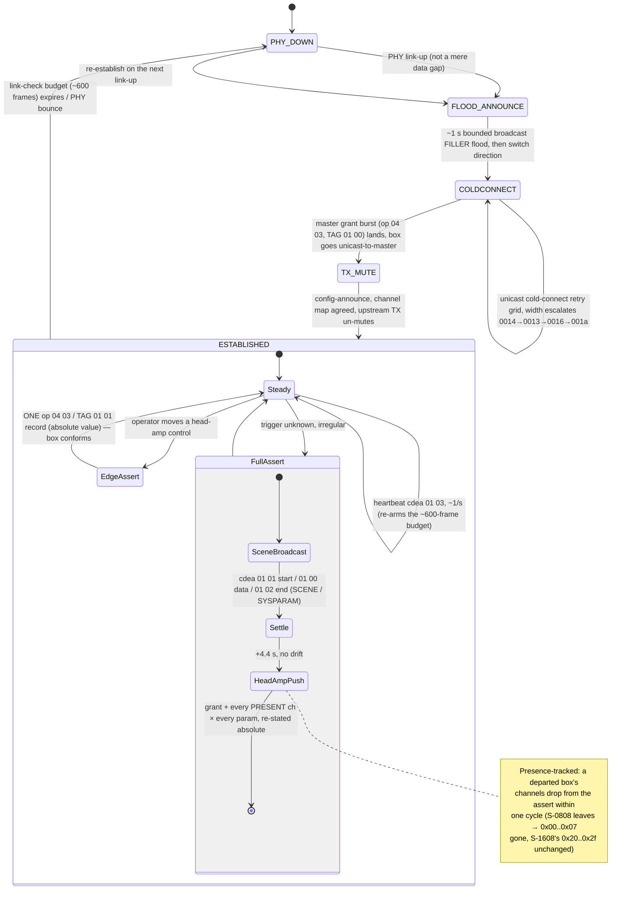

# REAC wire format

The on-wire schema of REAC.

## Overview

REAC is a proprietary **synchronous Layer-2** audio-over-Ethernet transport. One
**master** (a V-Mixer console) clocks the whole fabric; **slaves** (stageboxes)
lock to it; a **split** receiver listens passively. Up to **40 channels** per REAC
connection, 24-bit, at 44.1 / 48 / 96 kHz, over a single Cat5e run.

**The wire framing and the sample clock are owned by an on-board FPGA**, not the
device CPU. The FPGA assembles and parses the
`0x8819` Ethernet frames, generates the per-frame sample tick, and runs the
per-frame link-check counter; the CPU is handed already-parsed control messages and
runs only the high-level connection state machine on top. The practical consequence
for an outside observer: every byte-level fact in this document is something the FPGA
produces, and the connection *behaviour* in the lifecycle section is the only layer a
software node can mimic without re-implementing the framing/clock engine.

## Physical / link layer

- **100BASE-TX** (Fast Ethernet, full-duplex), Cat5e / RJ-45 — not 10 Mbit, not
  gigabit at the link layer.
- **EtherType `0x8819`** (non-IP). The capture filter is literally
  `ether proto 0x8819`.
- 40 channels of 24-bit at 96 kHz is ~92 Mbit/s — about filling one 100BASE-TX
  link. Roland publishes 0.375 ms protocol latency at 96 kHz (= 3 × 125 µs packet
  slots) and recommends unmanaged 100BASE-TX switches for splitting.

## Frame geometry (the schema)

The master's **downstream broadcast** is a fixed **1492-byte** Ethernet frame: 50 B
non-audio header + 1440 B audio + 2 B end marker. The audio block is constant
(rate-invariant) — always 40 channels; only the packet *rate* changes with sample
rate. (A stagebox's **upstream** return is a different, smaller frame carrying the
box's own input count — see *Upstream audio layout* below.)

| offset | size | field | notes |
|---|---|---|---|
| 0 | 6 | dst MAC | `ff:ff:ff:ff:ff:ff` = master→fabric (broadcast output); unicast to master MAC = slave→master (input) |
| 6 | 6 | src MAC | Roland OUI `00:40:ab` |
| 12 | 2 | EtherType | const `0x88 0x19` |
| 14 | 2 | counter | u16 LE, +1 per frame, wraps at 2¹⁶; `counter = b[14] | b[15]<<8` |
| 16 | 2 | type | byte-pair frame type (registry below) |
| 18 | 32 | data | control block, dispatched on `type`: class, fragment flags, record length, subtype, then the record's own body; `data[31]` is the block checksum. Modelled field-by-field in [`spec/reac.ksy`](spec/reac.ksy) — not opaque |
| 50 | 1440 | audio | 40 ch × 12 samp × 3 B, carried in **every** frame type incl. FILLER |
| 1490 | 2 | end | const `0xC2 0xEA` end marker |

The packet header (bytes 14..49) is exactly `{counter[2]; type[2]; data[32]}` =
36 bytes.

**Frame validation.** A receiver validates a frame by: (1) EtherType `0x8819`;
(2) `0xC2 0xEA` at the tail; (3) minimum length (header + end marker);
(4) checksum over `data[]`. FILLER frames are exempt from the checksum check.

## Sequence counter

16-bit **little-endian** at offset 14, +1 per frame, 16-bit wrap. The master sets
the counter on every outgoing packet from a monotonic counter.

Loss detection: `skipped = (counter - last - 1) & 0xFFFF`.

## Roles and addressing

- **Master** (V-Mixer) owns the clock and broadcasts output frames to
  `ff:ff:ff:ff:ff:ff`.
- **Slave** (stagebox) unicasts its input frames to the master MAC and locks to the
  master clock, learning the master MAC from the handshake.
- **Split** is a passive listener that periodically unicasts a `SPLIT_ANNOUNCE`
  (~1 s) but carries no audio. A pure passive tap can skip the announce entirely
  and still decode the broadcast audio — this is why a bridge can decode without
  participating.

OUI is `00:40:ab`; the open-source driver's stand-in device MAC is
`00:40:ab:c4:80:f6`; a real master's MAC is carried in `MASTER_ANNOUNCE`. A
per-device descriptor `{addr[6]; in_channels; out_channels}` is exchanged in the
handshake.

**REAC carries no zone or port id on the wire** — zone/port selection is an
external concern (switch / VLAN topology), not a protocol field.

## Frame-type registry — `type[2]`

| type | name | notes |
|---|---|---|
| `0x00 0x00` | FILLER | carries audio; receivers skip the checksum on this type |
| `0xcd 0xea` | CONTROL | class, fragment flags, record length and subtype in the first 5 `data[]` bytes |
| `0xcf 0xea` | MASTER_ANNOUNCE | ~1/s; carries master MAC + in/out channel counts |
| `0xce 0xea` | SPLIT_ANNOUNCE | the passive-split path |
| `0xc2 0xea` | ENDING | the split/teardown path (distinct from the `0xC2 0xEA` end-marker role at byte 1490) |

There is **no distinct "audio" frame type** — audio rides in every frame, including
FILLER. The master interleaves FILLER frames with periodic CONTROL / ANNOUNCE
frames while continuously filling the audio region.

**What a stagebox actually emits.** A stagebox in slave mode sends only
**FILLER** (`0x00 0x00`) and **CONTROL** (`0xcd 0xea`) — never `0xce 0xea` /
`0xc2 0xea`. The `SPLIT_ANNOUNCE` / `ENDING` types belong to the passive-split path;
a plain slave, a merge unit in slave mode, and a master's mirror output never source
them — only an actual split device does. `MASTER_ANNOUNCE` (`0xcf 0xea`) is
master-only and is likewise never sourced by a slave.

### The CONTROL record header — `data[0..4]`

**These five bytes are four fields, not a signature.** Read them separately or a
consumer ends up matching model-specific strings without knowing it.

| offset | field | meaning |
|---|---|---|
| `data[0]` | class | `0x01` session, `0x04` parameter |
| `data[1]` | fragment | bit 0 FIRST, bit 1 LAST |
| `data[2..3]` | `rec_len` | u16 **big-endian** — the record's byte count, counted from `data[4]` **inclusive** |
| `data[4]` | subtype | what the record is; **bit 7 set means the box is replying** |

The fragment field is why four "opcodes" exist for one class: `3` is a whole record
in one frame, `1` opens a multi-frame record, `0` continues it and `2` closes it. So
`01 00`, `01 01`, `01 02` and `01 03` are one class in four fragment states.

Class `0x01` subtypes:

| subtype | direction | record |
|---|---|---|
| `0x00` | master → box | scene transfer fragment |
| `0x01` | master → box | slot map — eight `{slot, cell+flags, sens}` records a frame |
| `0x10` | master → box | enroll group map, once before the grant burst |
| `0x81` | box → master | link-check ack |
| `0x80` `0x82` `0x83` `0x84` | box → master | **state-4 commit report** |

Class `0x04` is the DT1 container; see [Source control](#source-control-head-amp--op-0x04-0x03).

`data[5..31]` carry the record body and the block checksum.

#### The enroll group map (`0x10`)

Twelve payload bytes, sent once about 210 ms after the box's commit report and before the grant
burst:

```
cd ea 01 03 00 0d 10 | 04 PP 41×i 00×(5-i) 00×(5-o) c3×o | 00 … cksum
```

`04` is constant. **`PP` is the pace code** — the same rate class `cfea` block[17], the scene
body's `revision` and the chanmap `0xfe` marker carry: `0x00` at 48 kHz, `0x01` at 96 kHz,
`0x02` at 44.1 kHz. Then five input-group slots and five output-group slots, 5 × 8 = 40, the
console's own fabric width: `0x41` front-packed, one per group of eight enrolled inputs, and
`0xc3` back-packed in every slot that is not an input.

| box | map bytes |
|---|---|
| 8 in | `04 PP 41 00 00 00 00 00 c3 c3 c3 c3` |
| 32 in | `04 PP 41 41 41 41 00 00 00 00 00 c3` |

The pace reading is settled by one console and one box class two bytes apart: M-200
`00:40:ab:c9:cc:03` enrolling a 32-input box writes `04 00 41 41 41 41 …` at 48 kHz
(`matrix-m200-s4000-2026-07-24`) and `04 02 41 41 41 41 …` at 44.1 kHz
(`m200-enrol-s4000-441k-2026-09-13`, t = 1789330642.379775), identical in all eleven other
bytes. `0x01` read as a console generation only because the M-5000 is the desk that runs 96 kHz.

**A 16-input box is never sent one.** All 108 group maps in the corpus are 8-wide or 32-wide;
22 captures whose only box is an S-1608, five of them full enrolments, carry none. The `2 × 41`
row is a prediction of the width rule with no wire behind it.

#### Reading the state-4 commit report and the link-check ack

`01 03 00 10 82` is the box's **state-4 commit report** — the stagebox firmware
builds it after the master's scene transfer completes and after it has promoted the
staged slot table into the active one, and it carries the box's twelve-cell I/O
inventory. `01 03 00 01 81` is the box's link-check ack.

**The commit report's subtype is model-specific, so a parser must match bit 7, never
the literal byte.** An S-0808 and an S-4000S send the commit report with subtype
`0x84`; an S-1608 sends it with `0x82`. The discriminator is bit 7 of the subtype
byte (box replying), not the specific value.

The commit report's twelve inventory cells (`0x01` output, `0x02` analog input,
`0x03` absent, four channels each) read out as the real box on every model: S-0808
`02 02 01 01 03…` = 8 in / 8 out, S-1608 `02 02 02 02 01 01 03…` = 16 / 8, S-4000S
`02 02 02 02 02 02 02 02 01 01 03 03` = 32 / 8.

## The `data[32]` block — checksum (fully specified)

8-bit modular checksum over the 32 `data[]` bytes.

- **Verify:** `sum = (Σ data[0..31]) mod 256`; valid iff `sum == 0`.
- **Apply:** `s = (Σ data[0..30]) mod 256`; `data[31] = (256 - s) & 0xFF`
  (two's-complement negation, so the full 32-byte sum is 0 mod 256).
- FILLER frames are exempt.

## MasterAnnouncePacket — type `0xcf 0xea`

Overlaid on `data[]`: `{unknown1[9]; address[6]; inChannels; outChannels;
unknown2[4]}`.

| data | field | notes |
|---|---|---|
| 0..8 | unknown1[9] | master emits `ff ff 01 00 01 03 0d 01 04`. `data[6]` is the discriminator: `0x0d` = first/primary announce (carries channel counts); `0x0a` = the second announce confirming a split's identity (form `ff ff 01 00 01 03 0a 02 02`) |
| 9..14 | address[6] | the master's MAC |
| 15 | inChannels | master in-channel count |
| 16 | outChannels | master out-channel count |
| 17..20 | unknown2[4] | `01 <split?> 01 00`: `data[17]=0x01`; `data[18]=0x01` only immediately after a split-announce-response was just sent, else `0x00`; `data[19]=0x01`; `data[20]=0x00` |

A receiver recovers the master from `data[6]==0x0D` (master announce),
MAC = `data[9..14]`, in = `data[15]`, out = `data[16]`. A master also connected to a
slave doubles the advertised channel counts.

## Audio de-interleave — one layout, every generation

Audio is 40 ch × 12 samp × 3 B = 1440 B, laid out as the **even/odd braid**
(obs-h8819's `convert_to_pcm24lep`): per channel, `base = (ch & ~1)*3` and stride 120
(= n_channels × 3); even ch → `[sptr[3], sptr[0], sptr[1]]`, odd ch →
`[sptr[4], sptr[5], sptr[2]]`, treated as 24-bit little-endian. Equivalently a
16-bit-word byte swap of the channel pair packed big-endian.

One layout, both directions, **every mixer generation** — there is no per-generation
split, and no console or stagebox model uses plain sample-major (`(s*n_channels +
ch)*3`) ordering. `spec/reac.ksy` carries the reference implementation.

`reaccapture` additionally ships big-endian and 16-bit truncation variants of the same
de-interleave; s24le is the justification verified at 48 kHz.

## Channel-info block (in the CONTROL stream)

The master's CONTROL stream carries a channel-info block: one 3-byte record per
channel `[channel#, type-flags, gain]`, packed 8 records per CONTROL frame, rotating
channel numbers modulo 49. The block terminator is the channel-number byte `0xfe`
written at the rotation index for channel 48; its accompanying flag byte varies
(most often `0x00`, sometimes `0x01` or `0x02`) — the channel number, not the flag
byte, marks the terminator.

Other states stuff the interface MAC, a `0xc0 0xa8` (= 192.168) address prefix
repeated twice, and the ASCII tag `SYSP` (`53 59 53 50`) into `data[]`. A further
tag, `XVSCEN` (`58 56 53 43 45 4e`), is named in earlier notes and is **not on the
wire**. Three complete 8904-byte scene bodies reassembled from an M-200 at 44.1 kHz
(`reac-captures m200-enrol-441k-2026-09-13`, t = 542.135952 / 544.831563 /
547.525979, 343 frames each, declared length = recovered length, all three
byte-identical) carry exactly three ASCII runs of four or more printable bytes:
`1234` at +0x000, `SYSP` at +0x368 and `SCEN` at +0x37c. There is no `XVSCEN`, no
`SYSPARAM` and no `SCENE` — the three positives are the control for the negative.
This region is incompletely understood; treat `data[5..30]` of CONTROL frames as
partial beyond the 5-byte prefix and the channel-info block. (The `0xc0 0xa8` bytes
are a protocol fact — what a master stuffs into CONTROL frames — not anyone's
network address.)

## Sample rates and the audio clock

The downstream frame is **rate-invariant** — always 40 ch × 12 samples × 3 B = 1440 B
of audio. The sample rate is carried entirely in the **packet rate**, never in the
frame: `pps = rate / 12`, 12 samples per frame.

| rate | pps (downstream) | slot period | on the wire | status |
|---|---|---|---|---|
| 44.1 kHz | 3675 | 272.1 µs | 44.6 Mbit/s | verified |
| 48 kHz | 4000 | 250.0 µs | 48.5 Mbit/s | verified |
| 96 kHz | 8000 | 125.0 µs | 97.0 Mbit/s | verified |

The bandwidth column is the whole Ethernet slot, `pps × (1492 + 24) × 8` — see the link
budget at the end. The audio payload alone is 40 ch × 24 bit × rate: 46.1 Mbit/s at 48 kHz.

What changes with rate is **only the packet rate** — and therefore the inter-frame
interval (the *slot period*, `1e9 / pps` ns). The frame layout, channel count (40),
sample width (24-bit), and the 12-samples-per-frame packing are identical at every
rate, and there is **no rate field on the wire**. 44.1 and 48 kHz carry the same audio
bandwidth and differ only in slot timing; 96 kHz doubles the packet rate (and the
bandwidth), about saturating the 100BASE-TX link.

At 96 kHz the stream runs ~8000 pps carrying the same 1492 B / 40-channel frame as
48 kHz — the packet rate doubles; the channel count does not halve, and the frame does
not grow (the 48 kHz frame already fills ~99% of the 1500 MTU, so REAC adds packets
rather than enlarging them). A "24 tracks @96k" figure occasionally seen in a Roland
recorder manual is a storage limit, not a wire constraint. 44.1 kHz (3675 pps) follows
the same model, measured directly on the wire (272.12 µs slot, both downstream and a
box's own upstream return).

### How the clock is set and recovered

REAC has **one sample-clock master** (the console). The master emits a frame every slot
period from its own crystal — 272 µs at 44.1 kHz, 250 µs at 48 kHz, 125 µs at 96 kHz —
and that cadence *is* the fabric word clock. The slot tick is generated **in the FPGA**,
not in CPU software, which is why the device firmware shows the connection logic but not
the sample clock itself.

The receiver is a **hardware clock slave with no jitter buffer**. It does not buffer and
resample; it recovers word clock directly from packet **arrival cadence**, advancing its
clock one slot per frame. So a stagebox tolerates almost no arrival jitter — a late frame
is a late sample. This is why raw REAC runs badly over Wi-Fi, and why a bridge or relay
across a jittery hop has to re-impose the exact cadence the slave expects.

Master and slave agree on rate implicitly: the slave locks to whatever cadence the master
sends, so a rate mismatch simply means no lock and no audio. Connection is declared lost
after **1000 ms** without a sized audio frame. At the transport layer "connected" is
declared purely by **packet length** — the first frame whose length equals a full audio
frame flips `connected = true`, independent of the announce handshake. This is exactly
why a passive tap connects without participating.

### The stagebox's REAC Mode switch — M / S / SP

A stagebox has **no menu**. Its only mode control is one three-position switch labelled **REAC
Mode**, and it is read **at boot and never re-read** — moving it on a running box changes nothing.

| position | what the box does |
|---|---|
| **S** (slave) | the normal case: enrols with a console, takes its pace from that console's cadence |
| **SP** (split) | splits its I/O across TWO REAC ports so two consoles share one stagebox |
| **M** (master) | **the SPLITTER's clock role — NOT "act as a console"** |

**M does not make a stagebox a console, and does not make it a pace master.** The S-4000S
firmware carries `CMasterReacMsgParser` *and* `CSlave1ReacMsgParser` plus a `Clock Driver` /
`Tuning Task`: it is **clock-slave on its uplink and master on its split outputs**, re-driving a
recovered word clock onward to a downstream console. M and SP are therefore two halves of one
SPLIT feature, not two unrelated modes.

- A box on M with **no uplink** free-runs at its last-known rate — it has no clock to recover and
  re-drive; drift runs into the hundreds of ppm off nominal, against roughly −16 ppm for an
  enrolled box. Rate persists across a power cycle because there is **no rate field**: the box
  holds whatever cadence it last locked to.
- **An S-0808 on M emits no `cfea` announce; an S-1608 on M emits one about once a second.** A
  box on M never cold-connects, so it never presents as a joinable slave to a console — a console
  can neither grant it nor slave to it.
- **A box on M does grant a slave joining its split output.** The master side **echoes the
  joining box's own `cdea 04 03` records** — one echo per distinct record, plus its own `0000`
  head_mark — and that echo is the grant, the same mechanism a console uses (§4 of
  [`docs/mixer-protocol.md`](docs/mixer-protocol.md)).
- Its **REAC LED is lit and steady — identical to synched** — because its port really is fine.
  The lamp reports the box's view of its link, never whether it is talking to a given peer.

**A partially seated switch behaves exactly like SP**: link up, LED steady, zero frames. When a
box will not join, seat the switch firmly at S and power-cycle — the power-cycle is required, not
caution.

**Reading a silent box from its own FSM** (see [firmware-findings.md](firmware-findings.md)'s
source-level section, "9.2 BOX (stagebox / slave) FSM"). The box has three states and each has a
distinct wire signature:

| box state | what you see on the wire |
|---|---|
| `BOOT` / link-down | **nothing at all** |
| `ANNOUNCE` | broadcast filler flood at **8000 fps** + unicast `cdea 04 03` cold-connect |
| `LINKED` | unicast filler 8000 fps + `cdea 01 03 0001 81` heartbeat ~1/s |

A box emitting **zero frames** is in `BOOT` — it believes its own PHY is down, whatever the
far-end NIC reports; that points to a cable or a port at the box, not to the console.

The trigger is singular: **`BOOT -> ANNOUNCE` happens on PHY LINK-UP and nothing else — a
data gap does NOT trigger it.** A box that was streaming and went quiet does not recover on its
own; the remedy is to bounce the link, not to wait.

### Choosing what the master locks to — the clock-source selector

Although the recovered word clock itself is FPGA-internal and never appears on the REAC
audio wire, **the master exposes a clock-source selector** that decides which reference
its own crystal/PLL follows. The selectable sources are the front-panel-visible set:

- **WORD CLOCK** (external word-clock input),
- **REAC A** / **REAC B** (slave the master's clock to either REAC port),
- **INTERNAL** (free-run from the internal oscillator — the normal "I am the master"
  mode),
- **AES** (lock to an incoming AES/EBU pair).

This selection is made over the console's **separate control protocol**, not over the
REAC audio wire — it is a routing/configuration parameter, in the same family as
"which source feeds an output slot." Picking INTERNAL makes the desk free-run and clock
the whole fabric; picking REAC A/B makes the desk *slave* to a clock arriving on a REAC
port, which is how a master can be chained to follow another fabric. The on-wire REAC
cadence is unchanged in form by the selection — only *what* the master's slot tick is
disciplined to changes.

### How a re-clocking relay adapts across rates

A de-jitter relay (see [reac-repacer](https://github.com/FreeREAC/reac-repacer)) sits
between a jittery link and the clock-slave stagebox and must hand the slave a clean
cadence. Because there is no rate field, it **measures** the rate: count REAC frames on
the wired side over a short window, divide by elapsed time → pps → `rate = pps × 12`
(~3675 → 44.1 kHz, ~4000 → 48 kHz, ~8000 → 96 kHz). It then re-emits frames at exactly
`1e9 / pps` ns spacing on a recovered, free-running clock. On a **live rate change** (the
operator switches the console 48 ↔ 96 kHz) the measured pps jumps, so the relay
re-detects and re-locks to the new period. Since the frame itself is rate-invariant, the
relay never changes how it parses or forwards a frame — only the emit period changes with
rate.

### Building a transparent bridge or relay — the invariants it must not break

A relay that only re-clocks (previous section) is necessary but not sufficient once the
link it rides is lossy or jittery enough to threaten establishment and hold, not just
sample timing. Distilled from the connection model above and from the source-level FSM
in [firmware-findings.md](firmware-findings.md): a transparent REAC bridge MUST —

1. **Preserve upstream frame timing toward the master (box→master).** The master holds
   the link via its FPGA link-check counter, refilled once per received frame, and REAC
   assumes jitter-free full-duplex delivery. A bridge that re-clocks the downstream but
   raw-relays the upstream only fixes half the path: de-jitter the upstream on the
   master-facing side too, with a buffer that smooths the link's jitter while staying
   small against the link-check budget (600 frames = 75 ms @96 k / 150 ms @48 k). A
   single stall past that budget drops the link even when the box's own stream was
   otherwise clean.
2. **Never alter the heartbeat's keep-alive selector.** The established heartbeat
   (`cdea 01 03 0001 81`) carries `0x81` as its reply-match/re-arm byte; a `…00` variant
   LATCHES A DISCONNECT at the master. Relay it verbatim — never synthesize a `00`, and
   never drop it silently.
3. **Never change the box's identity (source MAC) mid-link.** The master force-disconnects
   on any peer-MAC change. A bridge that rewrites or clones MACs must keep the box's MAC
   stable for the life of the link.
4. **Don't disturb the establishment mute window.** The master TX-mutes for ~200 ms at
   connect while its own clock free-runs; the box completes its cold-connect inside that
   window. Let it pass cleanly rather than injecting into it.
5. **Preserve the channel-map cadence.** The established heartbeat walks 8 channel-ids
   per frame (a full 40-channel map every ~6 frames), and the master forces
   channel-count to 1 after 6 identical map frames in a row (the stale-guard debounce).
   Don't dedupe or coalesce map frames on the way through.
6. **Keep the frame counter (bytes 14–15) monotonic per stream.** The master's own clock
   free-runs even through the mute window, so a bridge that drops or reorders frames
   must still hand the endpoints a counter that only goes forward.
7. **Establishment needs a real PHY link-up, not just a data gap.** The box's cold-connect
   only fires on link-up (see the silent-box FSM above), so a bridge that wants to force
   a re-establish has to bounce the physical link, not merely stall the data.

### Downstream vs upstream packet rate

Both directions packetise the **same** way. A frame is `52 + n × 36` bytes, and the 36 is
12 samples × 3 B **at every sample rate**, so neither direction changes shape with rate:
what scales is the packet rate, `pps = rate / 12` → 3675 / 4000 / 8000. The only difference
between the two is `n` — downstream carries the fabric's 40 slots, upstream carries the
box's own input width.

- **Downstream** (master → box, broadcast): 40 channels → 1492 B, at 3675 / 4000 / 8000 pps.
- **Upstream** (box → master, unicast): the box's width → 340 B at 8 ch, 628 B at 16 ch,
  1204 B at 32 ch, at the same 3675 / 4000 / 8000 pps. Same even/odd braid as downstream;
  the channel map is FPGA-scrambled (see the upstream section).

The slot period a stagebox slaves to is the **downstream** cadence. `spec/reac.ksy` recovers
the width from the length by this law in **both** directions, and `spec/protocol-facts.yaml`
carries the 36 with its corpus evidence across 44.1 / 48 / 96 kHz.

## Source control (head-amp) — op `0x04 0x03`

> **Machine-readable spec.** The canonical field layout of this record lives in
> [`spec/reac.ksy`](spec/reac.ksy) (Kaitai Struct) — `ksc` compiles it to a
> C++ / Python / … parser, and CI regenerates it and validates it against known records on
> every change. The prose below is derived from that spec.

**Head-amp is a one-way declarative channel with a receiver that conforms.** A **master SENDS**
TAG `01 01` records — edge-triggered the instant an operator moves a control, then **periodically
RE-ASSERTS the full per-channel state** (the two-phase full assert below). The model is **DMX-style
declarative**: every record carries an **absolute** value (never a delta), nothing is ACKed, and the
master simply re-broadcasts the whole world, so a lost frame self-heals within one re-assert cycle —
the failure that bites is a lost **phantom-off** frame, which otherwise leaves 48 V sitting on the
XLR pins while the console reads "off". A **box RECEIVES** those records and conforms, addressed at
the **width-assigned CH base** it was granted (see *CH carries a per-model base* below).

**`0x04 0x03` is a record container, not a single message.** `rec_len` gives the record's data
length; `data[16..17]` is a **TAG** selecting the record type — see the registry below.

```
data[]:  0..1 op(04 03)   2..3 rec_len  4..7 REAC wrapper(00 02 00 fe)   8 len_echo(0e)
         9 f0   10 41   11 0a   12..14 model-id(00 00 12)   15 DT1 cmd(12)
        16..17 TAG   18..(18+n-1) DATA   (18+n) CKSUM_inner   (19+n) 0xf7   ...   31 CKSUM_block
```

### The container wraps a Roland DT1 SysEx

The "preamble" bytes and the pair of `12` bytes are **not** opaque padding: from `data[9]` the record
carries a genuine **Roland DT1 (Data Set 1) MIDI System-Exclusive** message — `f0 41 .. 12 .. f7` —
riding inside the REAC container. Decoded:

| data | bytes | field |
|---|---|---|
| 4..7 | `00 02 00 fe` | REAC console wrapper, **outside** the SysEx (part of the dispatch signature) |
| 8 | `0e` | SysEx-payload length echo (`= rec_len − 5`) |
| 9 | `f0` | MIDI SysEx start |
| 10 | `41` | Roland Corporation manufacturer ID |
| 11 | `0a` | Roland device (unit) ID |
| 12..14 | `00 00 12` | Roland 3-byte extended model ID (constant across M-200 / M-300 / M-5000) |
| 15 | `12` | Roland command — `0x12` **DT1** (Data Set, a write); `0x11` **RQ1** (Data Request) on the master's identity polls |
| 16..17 | TAG | high 2 bytes of the DT1 address (the record-type selector) |
| 18.. | DATA | DT1 address low bytes + data (for head-amp: `CH PARAM VALUE`) |
| 18+n | CKSUM | **Roland DT1 checksum** — `(128 − Σ(address+data)) mod 128` |
| 19+n | `f7` | MIDI SysEx end (EOX) |

So the two `12` bytes are the **model-ID low byte** (`00 00 12`) and the **DT1 command** (`0x12`) — not a
repeated marker — and the "TAG" is the **high half of the Roland 4-byte address** (`01 01 CH PARAM` for
head-amp), not a REAC-native tag. The record is a **standard Roland SysEx transport carried over
REAC**, and the head-amp payload below is its DT1 data.

**Frame dispatch:** the box-upstream audio braid frames also carry `cd ea 04 03`, but
with wrapper `02 00 fe 00` and **no** `f0 41` envelope. A genuine control record is identified by the
`cd ea` marker **and** the `00 02 00 fe` wrapper **and** the `f0 41` SysEx envelope — never by the
`04 03` opcode alone.

> **The `12 12` is two different bytes, not one repeated marker.** Reading it as one marker
> mislabels the model-ID low byte and hides the DT1 command that distinguishes a write (`DT1`) from a
> request (`RQ1`).

| `rec_len` | n (data bytes) | TAG | record | status |
|---|---|---|---|---|
| `0x0013` | 3 | `01 01` | **head-amp source control** | decoded below |
| `0x0013` | 3 | `05 00` | **identity poll/reply** | decoded — an addressed page, see `identity_data` in [`spec/reac.ksy`](spec/reac.ksy) |
| `0x0014` | 4 | `01 00` | **join grant** — master emits `06 00 01 00`; box-side echoes take other odd values while climbing | decoded — see `join_grant_data` in `spec/reac.ksy` |
| `0x0014` | 4 | `00 00` | — (`03 00 00 00`, also `03 00 01 01` on masters only and `03 00 00 01` on the S-1608 only) | the low two bytes are a field, not padding; not decoded |

TAG `05 00` also occurs at `rec_len 0x0016`, `0x001a` and `0x001b`, each carrying a different
per-model page of the same identity record — see `identity_data`.

> **Parsers must dispatch on TAG, not on the opcode.** Classifying every `04 03` as a grant means a
> slave in the join phase reads an engineer's preamp knob-turn as its grant: a live M-200 emits 628
> head-amp records for every 14 grants.

### The head-amp record — TAG `01 01`

```
data[16..17] = 01 01        TAG
data[18]     = CH           model_base + (channel - 1)  -- NOT flat zero-based, see below
data[19]     = PARAM        00 = phantom +48V · 01 = pad (-20 dB) · 02 = SENS
data[20]     = VALUE        phantom/pad: 00|01 · SENS: 0x00..0x37
data[21]     = CKSUM_inner
data[22]     = 0xf7         terminator
```

### Wire encoding and hardware actuation are two axes

**They are not points on one scale.** Wire encoding is about which record carries a field;
hardware actuation is about how many channels a single write switches. The two answers differ.

**Axis 1 — wire encoding: what a record carries.**

| carrier | field | per |
|---|---|---|
| DT1 record `{CH, PARAM, VALUE}` | `00` phantom, `01` pad, `02` SENS | **channel** — one channel per record, all three |
| slot map `{slot, cell+flags, sens}` | sens byte, flag bits 3/2/1 | **channel** — written for every slot |
| slot map | high nibble = **inventory cell** | **four** — only where `(slot & 3) == 0` |

The per-four field in the slot map is the *inventory cell*, not a head-amp parameter. The
box's ingest `FUN_0c002d42` writes the sens byte and the three flag bits unconditionally and
gates only `flags >> 4`.

**Axis 2 — hardware actuation: what one write switches.** **Per channel**, for phantom, pad
and SENS alike. `FUN_0c007fbc(bank, group)` sets its cursor to `group << 3` and loops eight
times; each iteration passes its own within-bank index and that slot's own value to
`FUN_0c00ac1e` (phantom), `FUN_0c00ac96` (pad) and `FUN_0c007e6a` (SENS).

**The eight is a bank, not an actuator.** The writers take `(bank, 0..7)` — two banks of
eight, which is an S-1608's sixteen analog inputs — and `group` selects which eight-slot
window of the 80-slot active table feeds them. It is the preamp's bank width and the refresh
loop's batch size. Nothing is switched eight channels at a time.

#### Phantom is per channel, not per four

Phantom rides one record per channel, exactly like pad and SENS: a write to CH `0x24` names
only `0x24` — `0x25`, `0x26` and `0x27` are unaffected. Across a corpus of phantom records
spanning three desk generations, most address a channel that is not a multiple of four,
including single-channel toggles on channels such as `0x26`, which a "per four" model could
not express. A full S-1608 sweep names `0x20..0x2f`, all sixteen; an S-0808 names
`0x00..0x07`; an S-4000S names `0x00..0x1f`.

**Head-amp is write-only on this wire.** The box never re-broadcasts head-amp state, so a
consumer keeps its own model; there is nothing to query and compare against.

The per-four grouping that does exist in the firmware is `PORTS_CH_PER_SLOT`, an inventory
cell used by the slot-map high nibble (see Axis 1 above) — a different structure from the
DT1 head-amp path, easily confused with it because both are per-four somewhere in the same
device.

**Hardware actuation below the wire is not verified.** No capture can show whether
energising `0x24` also energises `0x25..0x27` inside the box, because the box reports
nothing. Confirming it needs a physical 48 V measurement on the box's own inputs while only
one is written — never a soft indicator.

#### Two granularities, and "bank" is a third axis of its own

**The readback nibble is not a third granularity.** `FUN_0c007fbc`'s caller loop shifts the
group by 3 and iterates exactly 8, so group `g` covers `[g*8, g*8+8)` and **`g == ch >> 3`**,
which is the readback nibble's own index. So head-amp has exactly **two** granularities:

| granularity | what it is | function |
|---|---|---|
| **per channel** | actuation — phantom, pad and SENS each written individually | `FUN_0c007fbc` → `FUN_0c00ac1e` / `FUN_0c00ac96` / `FUN_0c007e6a` |
| **per eight** | refresh banking, and the readback nibble — one axis, not two | `FUN_0c007fbc` and its caller |

**"Bank" is a separate axis from "group":**

* **GROUP** — 0..9, and `group == ch >> 3`. Selects **which eight channels' data**: an
  eight-slot window of the 80-slot active table.
* **BANK** — selects **which eight physical preamps** receive it. **Not** a subdivision of
  channel space, and it does not index the active table.

`FUN_0c007fbc` takes both because they are independent.

The constants are in [`spec/protocol-facts.yaml`](spec/protocol-facts.yaml) (`head_amp`
group), the declarative source `spec/reac.ksy` and libreac are both checked against.

### Records follow the commit — never precede it

**There is no head-amp staging table.** A record writes the ACTIVE table directly, and the
State-4 commit **overwrites** that table wholesale. A record sent before the commit is
therefore erased, silently.

A channel is digitally **silent** until the commit promotes head-amp into the active table.
The commit is the sole promoter: it flushes the twelve groups and replies `01 03 00 10`.
Neither an establishment handshake nor an enrol frame arms a bank on its own. The transfer
that carries it, and what the box validates in it, is the scene transfer — see
[firmware-findings.md](firmware-findings.md) and the `scene` groups of
[`spec/protocol-facts.yaml`](spec/protocol-facts.yaml).

Ordering, for an implementer: **establish → scene transfer → commit → head-amp records.**

**Two nested checksums — an implementation must set BOTH, inner first.**

| | span | rule |
|---|---|---|
| inner | `data[16..21]` (TAG→CKSUM) | **sums to `0x80`** — the Roland DT1 checksum, op-`0403` records only |
| outer | `data[0..31]` | **sums to `0`** — every control frame (see the `data[32]` section) |

The **inner** sum is Roland's own DT1 checksum over the SysEx `address+data` span; the **outer** is
REAC's block checksum and is unrelated. The two rules coincide numerically here only because the
head-amp span is small (its maximum sum stays under 128, so `(128 − Σ) mod 128` and "sums to `0x80`"
land on the same byte). Inner verified 740/740 on the M-200/S-0808 census and **7130/7130 (100 %)**
across a full master×box corpus (M-200 / M-300 / M-5000 × S-0808 / S-1608 / S-4000); outer verified
across 11186 control frames of every op. Only `04 03` carries the inner sum, which is why it is easy to
miss. For the head-amp record the inner rule reduces to `CH + PARAM + VALUE + CKSUM == 0x7e`, since the
TAG contributes a constant `0x02` — but that shortcut is a special case, not the rule.

> **Build-order trap.** A builder that ends every record with the usual block-checksum helper ships a
> correct **outer** sum wrapped around a **garbage inner** one, and the box rejects a frame that looks
> perfect on the wire. Set the Roland DT1 (inner) checksum **first**, then the REAC block (outer) one.

### CH carries a BASE keyed on the box's DECLARED WIDTH

```
CH = base + (box_input - 1)

 8 inputs  (S-0808)   base  0  ->  0x00..0x07
16 inputs  (S-1608)   base 32  ->  0x20..0x2f     <- not 0x00..0x0f
32 inputs  (S-4000S)  base  0  ->  0x00..0x1f
```

**No byte on the wire carries this.** It is negotiated session state: the box declares its
width in the cold-connect escalation and the master picks the base. So a parser cannot read
it out of a frame — `spec/reac.ksy` deliberately does not encode it, and parses the
carriers as typed fields and stops there. A base-lookup implementation must refuse any width
it has not seen rather than guess.

**What exactly keys the base assignment is not fully separated** from two other carriers
present at the same time (the config-announce selector and `unit_offset`), which are
collinear with declared width on every establishment observed so far. Width is the one
named here because it is isolated from box identity (see below); it is not isolated from
the other two.

The base value is **stable per width**: two different physical S-1608 units base at 32 and
emit byte-identical TAG `05 00` records; three different consoles (M-200 / M-300 / M-5000)
address an S-1608 at 32; and an S-1608 alone on an empty segment, with `0..7` entirely free,
is still addressed at 32 — so the base is **not** collision-avoidance.

Two boxes coexist at `0x00..0x07` + `0x20..0x2f`, contiguous and non-overlapping. `(box_index
<< 5)` is **refuted**: the 32-ch S-4000 bases at 0, like the 8-ch S-0808. Why the S-1608
bases at 32 specifically is not verified — the three collinear carriers (width, the
config-announce selector, `board_config_code`) cannot be separated by any establishment
in the corpus; settling it needs a box-to-box enrolment (a pairing the corpus lacks
entirely), since that is the only pairing observed to produce the selector's other arm.

> **A master assigns the base from the box's declared WIDTH, not from a model-identity string.**
> `CH = channel - 1` is correct for an S-0808 and addresses nothing on an S-1608. The width is
> carried by the escalating cold-connect (`0014 → 0013 → 0016 → 001a`); the master allocates
> width-many contiguous fabric slots (see the grant-sweep note): 8-in → base 0, 16-in → base 32,
> 32-in → base 0 (a 32-in box cannot base at 32 — `0x20+31 = 0x3f` runs past the `0x2f` ceiling).

Everything else in the head-amp record is **model-independent**: the same three params in the same
order, the same `0x7e` invariant, the same linear SENS law, verified on both an S-0808 and an S-1608.

### The base is width-driven, not identity-driven

A software stagebox that establishes as a 16-channel box — and that sends **no** TAG `05 00`
model identity at all — is addressed by an M-200 at base **`0x20`**, exactly like a real
S-1608, and receives the full head-amp set: phantom, pad, and a complete SENS sweep
`0x00..0x37`, every frame satisfying the `0x7e` head-amp checksum. The box declares only its
width (via the cold-connect escalation) and gets the width's base; no `05 00` model string is
required.

### Open items

- The TAG `05 00` identity page's `0x0600` capability-block payload is stable per model but
  its field meaning is undecoded (see `identity_data` in `spec/reac.ksy`).
- Whether a phantom-off assert sent to a box actually drops 48 V at the XLR pins is not
  verified independently of the wire bytes — that needs a physical meter across the pins,
  never a soft indicator.

### The master's state assert tracks PRESENCE

When a box is unplugged, the master **drops its channels from the re-assert** within one cycle: an
S-0808 leaving removed `0x00..0x07` while the S-1608's `0x20..0x2f` continued unchanged. The assert
covers only boxes actually present.

### SENS ↔ dB — **pad-relative**

Roland SENS is **input sensitivity in dBu**: more negative = MORE gain.

```
dB = -10 - VALUE + (pad ? 20 : 0)

pad OFF:  0x00 = -10 dB (min sens) … 0x37 = -65 dB (max sens)
pad ON :  0x00 = +10 dB (min sens) … 0x37 = -45 dB (max sens)
```

**56 values over 55 dB = exactly 1 dB/step, linear** — no lookup table. Anchored against the
console's own display at -17/-40/-60/-65/-10 (pad off); every anchor lands.

**The pad shifts the SENS scale by +20 dB and the BOX applies the offset**, not the console: across
20 pad toggles the master never re-sent a SENS record, yet the console display moved 20 dB. The same
VALUE byte therefore means two different dB depending on pad state. Anchored twice: `-15 → +5` and
`-30 → -10`. Together pad+SENS span **+10 … -65 dBu (75 dB)** with a 35 dB overlap.

### What the box owns — exactly three parameters

A **full state push** dumps `ch1..ch8 × {phantom, pad, SENS}` = 24 records and nothing else: the
console enumerates its own complete box state, and the parameter space is closed at three.

Polarity, pan, main level, HPF and EQ never produce a `04 03` record. They are console-side DSP.

> **The boundary: the protocol carries only what cannot be done in software.** The box owns exactly
> the three things that are physically impossible anywhere else, all **pre-converter** — 48 V (a
> voltage on the XLR pins), pad (attenuation before the preamp: you cannot un-clip a sample), and
> SENS (analog gain before quantisation). Everything past the converter is arithmetic, and
> arithmetic belongs to whoever already performs it.

The S-0808 has **no analog HPF**. An analog HPF would be a legitimate box parameter under this
rule — it protects headroom from subsonic energy ahead of the preamp — but this particular box
does not implement one.

## State assertion — the master RE-ASSERTS, it does not issue commands

**This is the load-bearing behaviour of the control plane.** REAC control is raw Layer-2: broadcast,
**no ACK, no retransmit, no sequence recovery**. A dropped command would desynchronise a box
**permanently**, and nothing anywhere would notice. So a master does not send commands and hope — it
**continuously restates the world**, and the box conforms.

Every property of the control plane follows from this, and only coheres together:

- **Values are ABSOLUTE, never deltas.** A SENS ramp sends `0x04, 0x05, 0x06 …`, never "+1".
  Absolute values are **idempotent** — which is precisely what makes blind resending safe.
- **Nothing is ACKed**, and nothing needs to be: the re-assert *is* the reliability mechanism.
- **Broadcast with no addressing** — a declarative "this is the world" has no recipient.
- **Edge-triggered AND re-asserted**: immediate on an operator move, then restated regardless.

A master is therefore **not** correct if it only sends on change. It must re-assert.

The lifecycle below covers the whole thing end to end: the **box/slave establishment path** (left
of ESTABLISHED, the wire behaviour from *Connection lifecycle* above) and, inside ESTABLISHED, the
**master's head-amp control plane** (edge-emit plus periodic full re-assert).



The establishment path (PHY_DOWN → FLOOD_ANNOUNCE → COLDCONNECT → grant → TX_MUTE → ESTABLISHED, with
the PHY-bounce re-establish edge) is the box's wire behaviour; everything inside ESTABLISHED is the
master's declarative control plane. The box is the receiver on both — it locks the clock during
establishment and conforms to the head-amp records once established.

### The full assert is ONE operation in two phases

The head-amp push is **not on its own timer**. It follows a scene transfer (this document's name
for the `cdea 01 00` bulk data bracketed by `01 01` start / `01 02` end markers) by exactly 4.4 s,
with no drift. The bulk data carries two four-byte ASCII tags and no longer ones: `SYSP` at body
offset +0x368 and `SCEN` at +0x37c, neither of them in the `01 01`/`01 02` markers. `SCENE` and
`SYSPARAM` are not on the wire. The console announces its own DSP state, waits 4.4 s, then
announces its box state (`04 03` records: the grant, the `05 00` requests, and the head-amp
sweep). One operation, two phases, locked.

**The head-amp sweep is three records per input, so its length is the box's width.** An S-0808
draws 24; an S-1608 draws **48** — 16 channels at base 0x20, params `0x00` phantom, `0x01` pad,
`0x02` sens, measured record for record at both 44.1 kHz and 48 kHz from the same M-200.

**What triggers a full assert is not known.** The interval between assertions is irregular and
does not correlate with operator activity: consecutive scene transfers can recur every ~2.7 s for
long stretches with no head-amp push following most of them, so a scene transfer does not itself
guarantee one. It is not a simple timer, and no fixed cadence governs when one occurs — only its
internal 4.4 s two-phase structure, once it starts. Isolating the trigger needs a session that
varies one console-side action at a time against a continuous capture.

> **Safety consequence for any master implementation.** Fire-and-forget loses a frame and the box is
> wrong **forever**. The parameter where that bites is **phantom**: an engineer switches 48 V off to
> patch a ribbon mic, the frame is lost, the box never hears it, and the console shows "off" while
> 48 V sits on the pins. Re-assertion is what bounds that failure to one cycle instead of the rest
> of the session.

## Handshakes

> **Narrative companion.** [`docs/mixer-protocol.md`](docs/mixer-protocol.md) walks
> this whole control plane end to end — the master's downstream cadence, enrolment,
> head-amp control, the scene transfer, trunk VLANs and a box on M — as one
> continuous account rather than a field-by-field reference.

Audio is a continuous broadcast stream (no per-packet request/response). Connection
setup is a call/answer exchange in `data[32]`, driven by the periodic
`MASTER_ANNOUNCE` (re-announced ~once/second).

### Connection lifecycle as wire behaviour

Seen purely from the wire — independent of the byte-level state-machine detail below
— a slave joining a master moves through four observable phases:

1. **Link-up flood.** On PHY link-up (and only PHY link-up — not a mere data gap)
   the box **floods broadcast FILLER** (`0x00 0x00`, dst `ff:ff:ff:ff:ff:ff`) at full
   packet rate to announce its presence. This lasts on the order of a second, then it
   switches direction.
2. **Cold-connect / grant.** The box sends a short **unicast cold-connect burst** of
   CONTROL frames to the master; the master replies (on its broadcast stream) with a
   matching short **grant burst** of CONTROL frames whose payload echoes the box's
   identity. The grant lands as a ~100-frame burst (≈150 ms at 48 kHz / ≈75 ms at
   96 kHz). The instant it lands, the box **stops broadcasting and switches to
   unicast-to-master**.
3. **Config-announce.** The box sends a CONTROL frame advertising its own input count
   (its return channel map). The master and box exchange channel-map CONTROL frames to
   agree on the slot layout.
4. **Established.** Steady state is unicast FILLER/audio to the master MAC plus a
   periodic CONTROL frame (~1/s); the master holds its broadcast at the same ~1/s
   CONTROL + ~1/s `MASTER_ANNOUNCE` cadence.

**Loss tolerance is a per-frame budget.** Once established, the link is held against a
**frame-count budget of ~600 frames**. Because a frame is one sample slot, 600 frames
is **≈150 ms at 48 kHz / ≈75 ms at 96 kHz** of tolerated silence/loss before the link
is declared dead — so doubling the sample rate halves the wall-clock tolerance, which
is why a 96 kHz link is about twice as fragile over a lossy hop as a 48 kHz one.

**A keep-alive heartbeat re-arms the budget.** The established side emits a periodic
CONTROL heartbeat (~1/s) carrying a keep-alive selector byte; each heartbeat with the
selector set **re-arms the ~600-frame budget**. The same selector cleared latches an
explicit disconnect, and a change of the peer's source MAC also forces a disconnect.
So "connected" is maintained by *both* a steady stream of sized audio frames (the
~1000 ms no-audio cutoff) **and** the periodic heartbeat re-arm; losing either tears
the link down.

The byte-level state machines for the split and slave paths follow.

### Split handshake (fully specified)

1. `NOT_INITIATED` → on `MASTER_ANNOUNCE` with `data[6]==0x0d`: store master MAC +
   in/out channels → `GOT_MASTER_ANNOUNCE`.
2. send `SPLIT_ANNOUNCE` (`0xce 0xea`) `data[0..8] = 01 00 7f 00 01 03 08 43 05` +
   our MAC → `SENT_FIRST_ANNOUNCE`.
3. on `MASTER_ANNOUNCE` with `data[6]==0x0a` whose address == our MAC: read
   `splitIdentifier = data[16]` → `GOT_SECOND_MASTER_ANNOUNCE`.
4. send `SPLIT_ANNOUNCE` `data[0..8] = 01 00 <id> 00 01 03 08 42 05` + our MAC →
   `CONNECTED`.
5. keep-alive `SPLIT_ANNOUNCE` `01 00 <id> 00 01 03 02 41 05`, every announce
   checksummed; disconnect if no packet seen since last announce.

The master accepts a split by capturing the split's MAC from `data[9..14]` and
replying inside a `MASTER_ANNOUNCE` with a split-announce response: `data[6]=0x0a`,
`data[9..14]` = the split's MAC, `data[15]=0x00`, `data[16]=0x60` (the assigned split
identifier the split later echoes in its `data[2]`; "0x04 and up seems to be fine").

### Slave handshake (partial in the driver)

**The names below are the reacdriver project's own, and four of them mislabel the
underlying records** — see [The CONTROL record header](#the-control-record-header--data04-v).
`CONTROL_PACKET_TYPE_ONE/THREE` are a scene-transfer continuation fragment and the
master's slot map; `SLAVE_ANNOUNCE1` is the box's state-4 commit report and
`SLAVE_ANNOUNCE4` its link-check ack, so step 3's "5 CONTROL frames each prefixed
with SLAVE_ANNOUNCE1..4" is not five announces but four different records, one of
which the stagebox firmware only emits after it has committed the master's scene.

1. `NOT_INITIATED` → waits for `CONTROL_PACKET_TYPE_ONE` with `data[29]==0xc0`,
   `data[30]==0xa8`, then another with `data[5]==0x01`, `data[6]==0x01` and
   `data[7..12]==data[17..22]`: stores master MAC from `data[7..12]` →
   `GOT_MAC_ADDRESS_INFO`.
2. emits FILLER; on `CONTROL_PACKET_TYPE_THREE` → `SENDING_INITIAL_ANNOUNCE` (times
   out back after 2 s).
3. sends 5 CONTROL frames each prefixed with `SLAVE_ANNOUNCE1..4` + a fixed 19-byte
   handshake body, unicast to the master MAC → `HAS_SENT_ANNOUNCE`.
4. emits FILLER keep-alive.

reacdriver's own implementation of this path is incomplete; full master↔slave
establishment is observed live (see [firmware-findings.md](firmware-findings.md), slave
establishment).

## Upstream (stagebox→master) audio layout

A single REAC port is bidirectional; one tap captures both halves. Stagebox **INPUT**
channels travel toward the mixer as raw, pre-patch PCM (the mixer's internal patch
decides routing after they cross REAC). Stagebox **OUTPUT** channels travel from
mixer to box carrying whatever the mixer routed to each slot (post-routing).

The upstream return frame is unicast to the master MAC and is **smaller** than the
downstream broadcast: it carries the box's *own* input count, not the fabric's
40-channel block. It obeys the same `52 + n × 36` law, at every rate:

| width | box | audio bytes | frame |
|---|---|---|---|
| 8 ch | S-0808 | 288 = 8 × 3 × 12 | **340 B** |
| 16 ch | S-1608 | 576 = 16 × 3 × 12 | **628 B** |
| 32 ch | S-4000S | 1152 = 32 × 3 × 12 | **1204 B** |

The width is the only thing that varies — **not** the samples per frame, which are 12 at
44.1, 48 and 96 kHz alike. The packing is the **same even/odd braid as downstream** — see
"Audio de-interleave" above — confirmed on real captures at all three widths, the goldens in
`spec/fixtures/upstream.json`.

The audio is intact on the wire (every tone decoded clean) but the channel **MAP** is
scrambled — the wire does **not** carry input N → channel N. The scramble is
FPGA-owned, rate-independent, and not caused by loss / jitter or by a byte-transparent
re-pacer. Single-tone sweeps could not pin the exact map (a smooth sine reads high
autocorrelation across a plateau of adjacent bytes); resolving it needs distinct
simultaneous tones, one frequency per input. **The exact map is OPEN.**

The scramble is rate-independent, and so is the frame: a 16-channel box returns 628 B at
48 kHz exactly as at 96 kHz, at 4000 pps instead of 8000. The geometry is settled —
it is the `52 + n × 36` law, corpus-evidenced across all three rates in
`spec/protocol-facts.yaml`. The upstream packet rate at 48 kHz is 4000 pps, matching
downstream — measured directly on a box's unicast return (628 B frames over a known
interval).

Distinguishing source / direction from the wire alone: **source MAC** → which
device/port (OUI `00:40:ab`); **dest MAC** → direction/role (mixer→box OUTPUT frames
are broadcast `ff:ff:ff:ff:ff:ff`, box→mixer INPUT frames are unicast to the console
MAC); **802.1Q VLAN tag** → which REAC port/zone in a multi-zone trunk. **Not**
derivable from the wire: which physical jack or patch point a slot maps to — the frame
carries positional slots, no labels (resolve via a labelled-tone probe or the
remote-control query in [firmware-findings.md](firmware-findings.md)).

## Bandwidth / link budget

The frame is fixed, so the budget is arithmetic on the packet rate. Count the whole
Ethernet slot: the 1492 B frame **already includes** its 14-byte Ethernet header, so what
the wire adds beyond it is **24 bytes** — 8 preamble/SFD, 4 FCS, 12 inter-frame gap.
(Adding 38 double-counts the Ethernet header.)

    downstream bits/s = pps × (1492 + 24) × 8

| rate | pps | downstream on the wire |
|---|---|---|
| 44.1 kHz | 3675 | 44.6 Mbit/s |
| 48 kHz | 4000 | 48.5 Mbit/s |
| 96 kHz | 8000 | **97.0 Mbit/s** |

So a 96 kHz segment is 97.0 Mbit/s — it about saturates 100BASE-TX, which is why a 96 kHz
REAC run wants its own port and tolerates nothing else sharing it.

**On a gigabit trunk:** 1000 / 97.0 ≈ 10 segments is the ceiling, and **8 is the
recommended figure** — the remainder is headroom for the upstream returns, the control
plane and switch scheduling, none of which a 100 %-loaded trunk leaves room for.

Payload growth is ruled out: REAC adds **packets**, not bytes-per-packet.
